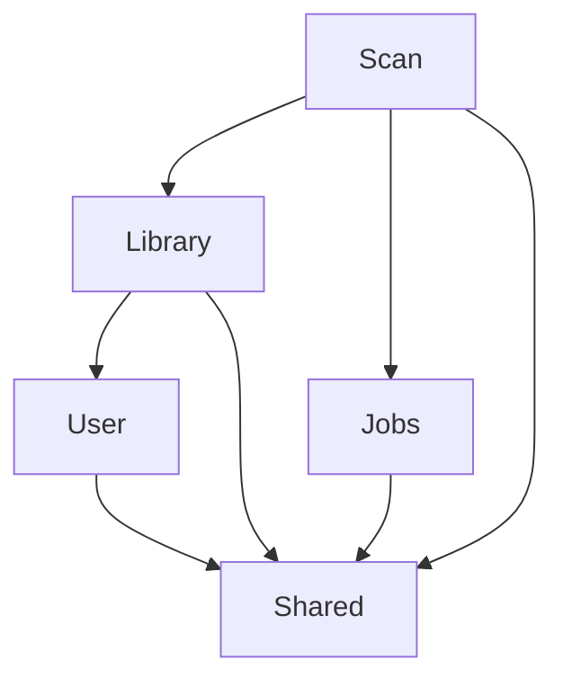

# MyMedia

MyMedia 是一个自托管媒体库服务端，面向个人或小圈子部署，不是 SaaS 多租户平台。当前阶段先交付可启动的模块化单体基础设施：媒体库按 `VIDEO` / `IMAGE` 两个域分区，管理员负责配置媒体库，用户通过 HTTP Basic 登录并按授权访问资源。

## 技术栈

- Spring Boot `4.1.0`
- Java `25`
- Spring Modulith `2.1.0`
- PostgreSQL `17`（Docker 镜像；验收使用 PostgreSQL `17.11`）
- Maven `3.9.9`
- Flyway、Spring Data JPA、Spring Security、Testcontainers

## 快速开始

要求本机已安装 JDK 25、Maven 和 Docker Desktop：

```bash
docker compose up -d postgres
mvn -B -ntp spring-boot:run
```

`compose.yaml` 现在还定义了 `app`（容器化整套应用）和一次性引导容器
`demo-seed`：执行 `docker compose up -d --build`（不指定服务名）可以把三者一起拉起来，
不需要本机装 JDK/Maven（`demo-seed` 要等 P13 的 `scripts/bootstrap-demo.sh` 落地才会跑通，
在此之前它退出非 0 是预期行为，不影响 `postgres`/`app` 正常起来并转为健康）。
`app` 的媒体目录挂载宿主 `./data/media`，**必须可写**：Windows Docker Desktop 实测开箱即可写；
Linux 宿主上 bind mount 会继承宿主目录属主，容器内是 uid 1000，写不进去时执行
`sudo chown -R 1000:1000 data/media` 即可。

首次启动会由 `src/main/java/com/mymedia/user/AdminBootstrap.java` 幂等创建本地演示管理员 `admin/admin`。生产部署必须覆盖默认凭证，例如：

```bash
MYMEDIA_ADMIN_USERNAME=owner \
MYMEDIA_ADMIN_PASSWORD='change-me-now' \
mvn -B -ntp spring-boot:run
```

PowerShell 5.1 可写成 `$env:MYMEDIA_ADMIN_USERNAME="owner"` 和 `$env:MYMEDIA_ADMIN_PASSWORD="change-me-now"` 后再启动。应用配置在 `src/main/resources/application.yml`，schema 只由 Flyway 管理，Hibernate 使用 `ddl-auto: validate`。

验证服务：

```bash
curl -s http://localhost:8080/actuator/health
curl -s -u admin:admin http://localhost:8080/api/libraries
curl -s -u admin:admin -X POST http://localhost:8080/api/libraries \
  -H 'Content-Type: application/json' \
  -d '{"name":"电影","domain":"VIDEO","rootPath":"/media/movies"}'
```

PowerShell 调用 `curl.exe` 时，需要保留 JSON 属性引号；单引号字符串不需要反斜杠转义，可以使用 `'{"name":"电影","domain":"VIDEO","rootPath":"/media/movies"}'` 作为 `-d` 参数。

登录后访问 `http://localhost:8080/` 即可使用浏览器前端（首次使用先在「媒体库管理」页建一个媒体库并点「开始扫描」）。

### 前端开发模式

`mvn spring-boot:run`/`mvn package` 会自动下载 Node、跑 `npm ci`/`npm run build`，把 Vite 构建产物拷进 `target/classes/static/` 随 jar 一起交付——只做后端迭代、不改前端时，加上 `-DskipFrontend=true` 跳过这一段，节省每次构建的时间：

```bash
mvn -B -ntp spring-boot:run -DskipFrontend=true
```

前端本身开发时可以用 Vite 的开发服务器（带热重载），不需要每次改动都跑一遍后端构建：

```bash
cd frontend
npm run dev
```

Vite 开发服务器默认监听 `5173`，会把 `/api/**` 请求代理到本机 `8080`（后端需要已经用上面的方式单独启动）。前端依赖精确锁定版本（不写 `^`/`~`），提交了 `package-lock.json`；TypeScript 必须是 `6.0.3`，`typescript@latest`（`7.x`，Go 原生重写版）与本项目用的 `vue-tsc` 不兼容，详见 [前端 walkthrough](docs/walkthrough/07-前端.md#31-typescript-603-必须锁死不能用-latest)。

### 界面预览

浏览器前端把两个域做成两套视觉语言——视频发光、图片反光，具体设计定稿见
[计划 07 前端设计定稿](docs/superpowers/plans/2026-08-17-00-总览与交接.md)（§13.5）。
本环境暂无浏览器自动化能力，无法附真实截图，先用文字描述四个最能体现设计的界面，
截图待后续有真实浏览器环境时补充：

- **视频首页**：冷色调（`#08090e`）背景，卡片用彩色琥珀外发光（`#ffb020`）标示当前正在播放的媒体域；继续观看横向滚动一行。
- **播放器**：原生 `<video>` + 自定义控制条，悬停进度条时从雪碧图（100 帧 + WebVTT）里换算出对应时刻的画面浮出显示，零额外网络请求。
- **图片首页**：暖色调（`#12100d`）背景，书卡左缘 4px 亮—暗—亮渐变书脊，CSS 多列瀑布流按封面原始比例排布，不裁切。
- **阅读器**：整个应用唯一的亮面——满幅纸色（`#f2ede3`）背景，chrome 全部隐藏，双页模式下按 `rtl`/`ltr` 自动镜像翻页方向。

## 架构

这是一个模块化单体，而不是按服务拆分的微服务。顶层包就是模块，当前由 `shared`、`user`、`library`、`jobs`、`scan` 五个模块组成；实现类和 repository 默认保持 package-private，跨模块只依赖公开 API。`ApplicationModules.verify()` 在测试阶段强制依赖边界，`Documenter` 自动生成模块图和 AsciiDoc 说明。

构建后查看原始图和模块文档：

- [模块图 PlantUML 源文件](target/spring-modulith-docs/components.puml)
- [完整模块文档](target/spring-modulith-docs/all-docs.adoc)
- [基础设施 walkthrough](docs/walkthrough/01-基础设施.md)

`components.puml` 渲染出的模块关系如下；图中的依赖与构建产物保持一致：



数据层同样按边界分工：Flyway 迁移创建 `users`、`libraries`、`library_access` 和 `job`；媒体域使用 `libraries.domain` 加复合外键锚点，任务域用 PostgreSQL 行锁实现持久化队列。关键决策见 [ADR-001](docs/adr/ADR-001-域分区的数据库级强制.md)、[ADR-002](docs/adr/ADR-002-认证方案.md) 和 [ADR-003](docs/adr/ADR-003-用数据库任务表替代消息队列.md)。

## 已实现功能

- Spring Modulith 五模块边界验证与自动架构文档
- Spring Boot Actuator health、Docker Compose PostgreSQL 17、Flyway 迁移
- HTTP Basic 无状态认证、`ADMIN` / `USER` 角色和 bcrypt 密码哈希
- fresh database 的幂等初始管理员引导，用户名和密码支持环境变量覆盖
- 媒体库创建与列表查询，支持 `VIDEO` / `IMAGE` 域
- 管理员隐式访问全部媒体库，普通用户通过 `library_access` 授权
- 无权媒体库统一返回 `404`，避免泄露资源存在性
- PostgreSQL `job` 表、去重入队、`FOR UPDATE SKIP LOCKED` 抢占、租约回收、重试退避和 owner-fenced 回写
- PostgreSQL `pg_trgm` 扩展验收与 Testcontainers 真实数据库集成测试
- 目录扫描：递归发现媒体文件并忽略 NFO 等非媒体文件
- 增量对账：按 size + mtime 更新 `scanned_file`，并保留 `MISSING` 记录
- 改名与移动检测：用采样哈希匹配新旧路径并保留物理文件 id
- 符号链接环防护：通过真实路径去重、最大深度和访问失败剪枝避免无限递归
- 视频条目浏览：电影、剧集、分组和文件详情
- 视频目录树视图与面包屑导航
- HTTP Range 流式播放与 ETag / If-Range 断点续传
- 视频播放进度记录
- 继续观看列表
- 图片节点树浏览（任意深度，目录即整理结果）
- CBZ 流式阅读（随机访问单页，绝不解压到磁盘）
- 阅读模式覆盖（书 / 文件夹 / 自动）
- 阅读进度记录
- 继续阅读列表
- 目录改名 / 移动无损跟随（子树一条 UPDATE 整体搬走）

## 路线图

完整路线见设计文档 [§11 实施路线图](docs/superpowers/specs/2026-08-17-mymedia-design.md#11-实施路线图)。后续阶段按以下顺序推进：

- P3：扫描框架、物理文件对账和采样哈希改名检测
- P4-P5：视频域模型、目录视图、Range 播放和播放进度
- P6-P7：图片域节点树、CBZ 索引、流式阅读和阅读进度
- P8-P9：预览生成、ffprobe、封面和可选元数据刮削
- P10-P11：搜索、标签、收藏、分享链接和分片上传
- P12：响应式前端
- P13：版权安全 seed 数据与演示体验
- P14（可选）：转码 / HLS

## ADR 索引

- [ADR-001：用复合外键在数据库层面强制域分区](docs/adr/ADR-001-域分区的数据库级强制.md)：解释 `UNIQUE (id, domain)` 与复合外键。
- [ADR-002：认证采用 HTTP Basic + 无状态](docs/adr/ADR-002-认证方案.md)：解释 Basic、bcrypt 和 CSRF 取舍。
- [ADR-003：用 PostgreSQL 任务表替代消息队列](docs/adr/ADR-003-用数据库任务表替代消息队列.md)：解释 `SKIP LOCKED`、任务历史和租约。
