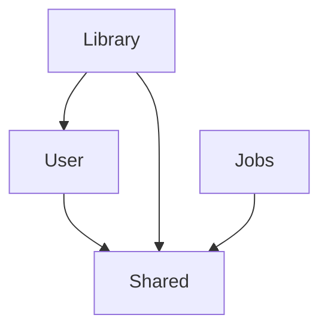

# MyMedia

MyMedia 是一个自托管媒体库服务端，面向个人或小圈子部署，不是 SaaS 多租户平台。当前阶段先交付可启动的模块化单体基础设施：媒体库按 `VIDEO` / `IMAGE` 两个域分区，管理员负责配置媒体库，用户通过 HTTP Basic 登录并按授权访问资源。

## 技术栈

- Spring Boot `4.1.0`
- Java `25`
- Spring Modulith `2.1.0`
- PostgreSQL `17`（Docker 镜像；验收使用 PostgreSQL `17.11`）
- Maven `3.9.9`
- Flyway、Spring Data JPA、Spring Security、Testcontainers

## 快速开始

要求本机已安装 JDK 25、Maven 和 Docker Desktop：

```bash
docker compose up -d
mvn -B -ntp spring-boot:run
```

首次启动会由 `src/main/java/com/mymedia/user/AdminBootstrap.java` 幂等创建本地演示管理员 `admin/admin`。生产部署必须覆盖默认凭证，例如：

```bash
MYMEDIA_ADMIN_USERNAME=owner \
MYMEDIA_ADMIN_PASSWORD='change-me-now' \
mvn -B -ntp spring-boot:run
```

PowerShell 5.1 可写成 `$env:MYMEDIA_ADMIN_USERNAME="owner"` 和 `$env:MYMEDIA_ADMIN_PASSWORD="change-me-now"` 后再启动。应用配置在 `src/main/resources/application.yml`，schema 只由 Flyway 管理，Hibernate 使用 `ddl-auto: validate`。

验证服务：

```bash
curl -s http://localhost:8080/actuator/health
curl -s -u admin:admin http://localhost:8080/api/libraries
curl -s -u admin:admin -X POST http://localhost:8080/api/libraries \
  -H 'Content-Type: application/json' \
  -d '{"name":"电影","domain":"VIDEO","rootPath":"/media/movies"}'
```

PowerShell 调用 `curl.exe` 时，需要保留 JSON 属性引号；单引号字符串不需要反斜杠转义，可以使用 `'{"name":"电影","domain":"VIDEO","rootPath":"/media/movies"}'` 作为 `-d` 参数。

## 架构

这是一个模块化单体，而不是按服务拆分的微服务。顶层包就是模块，当前由 `shared`、`user`、`library`、`jobs` 四个模块组成；实现类和 repository 默认保持 package-private，跨模块只依赖公开 API。`ApplicationModules.verify()` 在测试阶段强制依赖边界，`Documenter` 自动生成模块图和 AsciiDoc 说明。

构建后查看原始图和模块文档：

- [模块图 PlantUML 源文件](target/spring-modulith-docs/components.puml)
- [完整模块文档](target/spring-modulith-docs/all-docs.adoc)
- [基础设施 walkthrough](docs/walkthrough/01-基础设施.md)

`components.puml` 渲染出的模块关系如下；图中的依赖与构建产物保持一致：



数据层同样按边界分工：Flyway 迁移创建 `users`、`libraries`、`library_access` 和 `job`；媒体域使用 `libraries.domain` 加复合外键锚点，任务域用 PostgreSQL 行锁实现持久化队列。关键决策见 [ADR-001](docs/adr/ADR-001-域分区的数据库级强制.md)、[ADR-002](docs/adr/ADR-002-认证方案.md) 和 [ADR-003](docs/adr/ADR-003-用数据库任务表替代消息队列.md)。

## 已实现功能

- Spring Modulith 四模块边界验证与自动架构文档
- Spring Boot Actuator health、Docker Compose PostgreSQL 17、Flyway 迁移
- HTTP Basic 无状态认证、`ADMIN` / `USER` 角色和 bcrypt 密码哈希
- fresh database 的幂等初始管理员引导，用户名和密码支持环境变量覆盖
- 媒体库创建与列表查询，支持 `VIDEO` / `IMAGE` 域
- 管理员隐式访问全部媒体库，普通用户通过 `library_access` 授权
- 无权媒体库统一返回 `404`，避免泄露资源存在性
- PostgreSQL `job` 表、去重入队、`FOR UPDATE SKIP LOCKED` 抢占、租约回收、重试退避和 owner-fenced 回写
- PostgreSQL `pg_trgm` 扩展验收与 Testcontainers 真实数据库集成测试

## 路线图

完整路线见设计文档 [§11 实施路线图](docs/superpowers/specs/2026-08-17-mymedia-design.md#11-实施路线图)。后续阶段按以下顺序推进：

- P3：扫描框架、物理文件对账和采样哈希改名检测
- P4-P5：视频域模型、目录视图、Range 播放和播放进度
- P6-P7：图片域节点树、CBZ 索引、流式阅读和阅读进度
- P8-P9：预览生成、ffprobe、封面和可选元数据刮削
- P10-P11：搜索、标签、收藏、分享链接和分片上传
- P12：响应式前端
- P13：版权安全 seed 数据与演示体验
- P14（可选）：转码 / HLS

## ADR 索引

- [ADR-001：用复合外键在数据库层面强制域分区](docs/adr/ADR-001-域分区的数据库级强制.md)：解释 `UNIQUE (id, domain)` 与复合外键。
- [ADR-002：认证采用 HTTP Basic + 无状态](docs/adr/ADR-002-认证方案.md)：解释 Basic、bcrypt 和 CSRF 取舍。
- [ADR-003：用 PostgreSQL 任务表替代消息队列](docs/adr/ADR-003-用数据库任务表替代消息队列.md)：解释 `SKIP LOCKED`、任务历史和租约。
