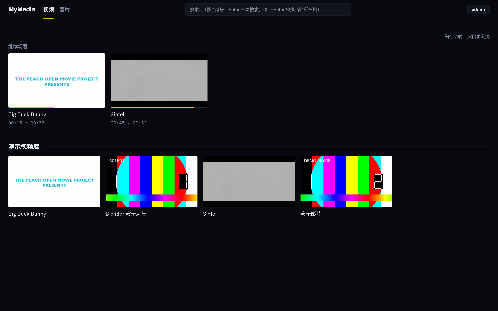
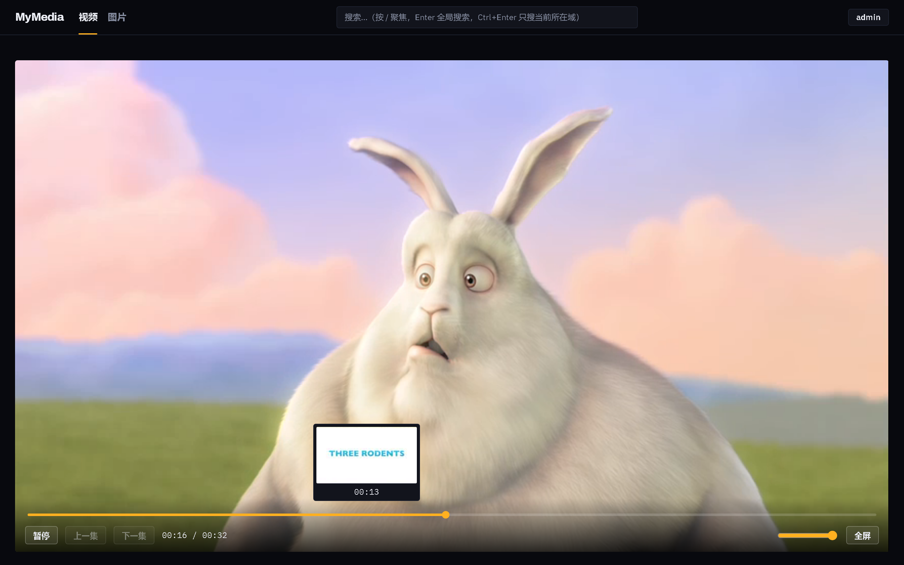
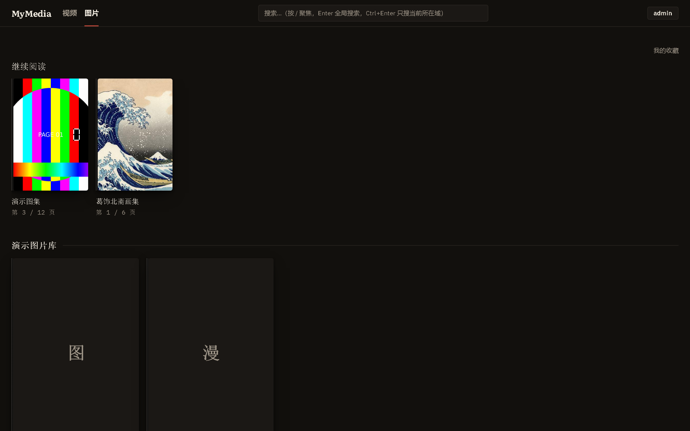
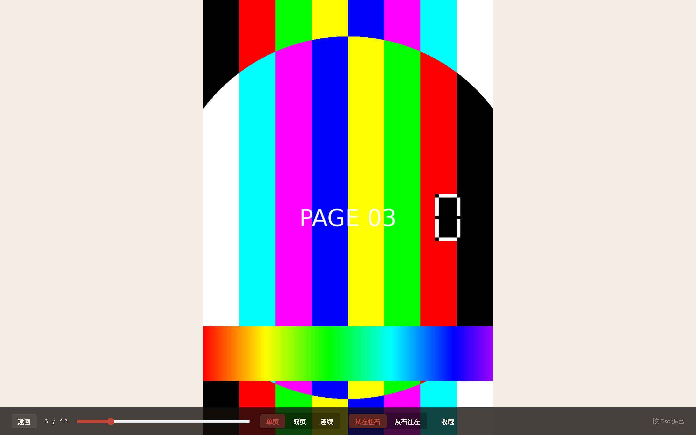
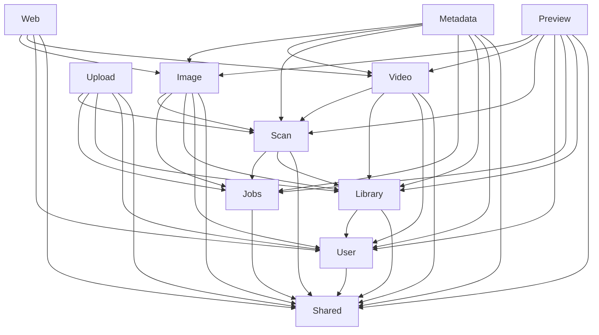
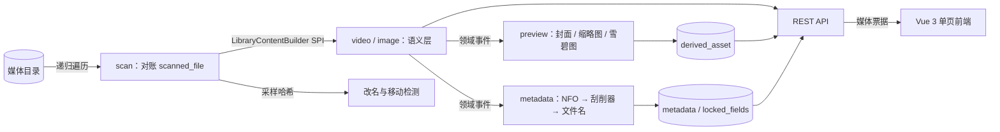

# MyMedia

MyMedia 是一个自托管媒体库服务端，面向个人或小圈子部署，不是 SaaS 多租户平台。当前阶段先交付可启动的模块化单体基础设施：媒体库按 `VIDEO` / `IMAGE` 两个域分区，管理员负责配置媒体库，用户通过 HTTP Basic 登录并按授权访问资源。

## 技术栈

- Spring Boot `4.1.0`
- Java `25`
- Spring Modulith `2.1.0`
- PostgreSQL `17`（Docker 镜像；验收使用 PostgreSQL `17.11`）
- Maven `3.9.9`
- Flyway、Spring Data JPA、Spring Security、Testcontainers

## 快速开始

要求本机装了 Docker（Compose v2）。**不需要装 JDK、Maven、Node 或 ffmpeg**——都在镜像里。

```bash
git clone https://github.com/kisima0225/MyMedia.git
cd MyMedia
cp .env.example .env          # 按需改管理员账号与分享密钥
./scripts/fetch-seed.sh       # Windows: powershell -ExecutionPolicy Bypass -File .\scripts\fetch-seed.ps1
docker compose up -d --build
```

首次构建要拉依赖并下载 Node，十几分钟量级；之后重启是秒级。起来之后打开
<http://localhost:8080>，用 `.env` 里的账号登录——演示媒体库已经由 `demo-seed`
服务自动建好并扫描过了。

**没有网络？** 跳过 `fetch-seed`，改用离线兜底，用镜像里自带的 ffmpeg 现场合成演示媒体：

```bash
docker compose up -d --build
docker compose run --rm --user root --entrypoint bash \
  -v "$PWD/scripts/generate-seed-offline.sh:/seed/gen.sh:ro" app /seed/gen.sh
docker compose up -d --force-recreate demo-seed
```

离线模式生成的是彩条视频与带页码的散图，**不含 CBZ**（容器里没有 zip，
而图片域本来就原生支持散图目录）——CBZ 的演示需要在线路径。

`app` 的媒体目录挂载宿主 `./data/media`，**必须可写**。容器里 app 以 uid 1000 运行，
而 bind mount 保留的是**创建这些目录的那个身份**——决定因素是「谁建的目录」，不是宿主的操作系统：

- 宿主上直接建（PowerShell 跑 `fetch-seed.ps1`、或本机有 ffmpeg 时跑离线生成器）：Windows Docker
  Desktop 实测开箱即可写。
- **在容器里以 root 建**（Git Bash / Linux 上按 README 用一次性容器跑 `fetch-seed.sh`，或用
  `--user root` 跑离线生成器）：目录会是 `root:root 755`，app 写不进去，**Web 上传的最后一步会以
  `AccessDeniedException: /media/video/xxx` 失败**。两个 seed 脚本因此在检测到自己是 root 时会
  自动 `chown -R 1000:1000`；万一仍然写不进去，手动补一次 `sudo chown -R 1000:1000 data/media`。

首次启动会由 `src/main/java/com/mymedia/user/AdminBootstrap.java` 幂等创建初始管理员，账号密码来自 `.env` 里的 `MYMEDIA_ADMIN_USERNAME` / `MYMEDIA_ADMIN_PASSWORD`（默认 `admin`/`admin`）；面向他人的部署必须覆盖默认凭证，具体见下方「部署清单」。

### 本机开发（不用容器）

只做后端迭代、不想每次改动都等镜像重新构建时，可以只用 Docker 起数据库，本机直接装 JDK 25、Maven 跑应用：

```bash
docker compose up -d postgres
mvn -B -ntp spring-boot:run
```

这条路径下管理员账号覆盖走 shell 环境变量（容器路径走的是 `.env`，见上文）：

```bash
MYMEDIA_ADMIN_USERNAME=owner \
MYMEDIA_ADMIN_PASSWORD='change-me-now' \
mvn -B -ntp spring-boot:run
```

PowerShell 5.1 可写成 `$env:MYMEDIA_ADMIN_USERNAME="owner"` 和 `$env:MYMEDIA_ADMIN_PASSWORD="change-me-now"` 后再启动。应用配置在 `src/main/resources/application.yml`，schema 只由 Flyway 管理，Hibernate 使用 `ddl-auto: validate`。

这条路径不会自动建演示媒体库——`demo-seed` 只在容器编排里跑。想要演示数据，可以先走一遍上面的容器路径生成 `data/media/**`，再切回本机路径复用同一份文件；或者直接用下面的 `curl` 命令自己建库。

验证服务（两条路径最终都在 `http://localhost:8080` 暴露同一套 API）：

```bash
curl -s http://localhost:8080/actuator/health
curl -s -u admin:admin http://localhost:8080/api/libraries
curl -s -u admin:admin -X POST http://localhost:8080/api/libraries \
  -H 'Content-Type: application/json' \
  -d '{"name":"电影","domain":"VIDEO","rootPath":"/media/movies"}'
```

PowerShell 调用 `curl.exe` 时，需要保留 JSON 属性引号；单引号字符串不需要反斜杠转义，可以使用 `'{"name":"电影","domain":"VIDEO","rootPath":"/media/movies"}'` 作为 `-d` 参数。

登录后访问 `http://localhost:8080/` 即可使用浏览器前端（容器路径下演示媒体库已经建好；本机开发路径首次使用可以先在「媒体库管理」页建一个媒体库并点「开始扫描」）。

### 前端开发模式

`mvn spring-boot:run`/`mvn package` 会自动下载 Node、跑 `npm ci`/`npm run build`，把 Vite 构建产物拷进 `target/classes/static/` 随 jar 一起交付——只做后端迭代、不改前端时，加上 `-DskipFrontend=true` 跳过这一段，节省每次构建的时间：

```bash
mvn -B -ntp spring-boot:run -DskipFrontend=true
```

前端本身开发时可以用 Vite 的开发服务器（带热重载），不需要每次改动都跑一遍后端构建：

```bash
cd frontend
npm run dev
```

Vite 开发服务器默认监听 `5173`，会把 `/api/**` 请求代理到本机 `8080`（后端需要已经用上面的方式单独启动）。前端依赖精确锁定版本（不写 `^`/`~`），提交了 `package-lock.json`；TypeScript 必须是 `6.0.3`，`typescript@latest`（`7.x`，Go 原生重写版）与本项目用的 `vue-tsc` 不兼容，详见 [前端 walkthrough](docs/walkthrough/07-前端.md#31-typescript-603-必须锁死不能用-latest)。

### 界面预览

浏览器前端把两个域做成两套视觉语言——视频发光、图片反光，具体设计定稿见
[计划 07 前端设计定稿](docs/superpowers/plans/2026-08-17-00-总览与交接.md)（§13.5）。
截图用 [`tools/screenshots`](tools/screenshots) 对着一个跑起来的真实实例现拍，不是手工摆拍：

| | |
|---|---|
|  |  |
| 视频首页：冷色底 + 彩色外发光卡片 | 播放器：悬停进度条从雪碧图换帧，零额外请求 |
|  |  |
| 图片首页：暖色底 + 落影 + 4px 书脊，瀑布流不裁切封面 | 阅读器：全应用唯一的亮面，满幅纸色 |

## 架构

这是一个模块化单体，而不是按服务拆分的微服务。顶层包就是模块，当前有
`shared` / `user` / `library` / `jobs` / `scan` / `video` / `image` / `preview` /
`metadata` / `upload` / `web` 十一个；实现类和 repository 默认保持 package-private，
跨模块只依赖公开 API 与命名接口（`scan::spi`、`scan::events` 这种形式）。
依赖方向写在每个模块 `package-info.java` 的 `allowedDependencies` 上，由
`ApplicationModules.verify()` 在测试阶段强制——把 `video` 的声明收成 `{"shared"}`
会立刻报出 11 条越界依赖，这个强制点是真的会拦人的。为什么选模块化单体见
[ADR-009](docs/adr/ADR-009-为什么是模块化单体.md)。

构建后查看原始图和模块文档：

- [模块图 PlantUML 源文件](target/spring-modulith-docs/components.puml)
- [完整模块文档](target/spring-modulith-docs/all-docs.adoc)
- [基础设施 walkthrough](docs/walkthrough/01-基础设施.md)

`components.puml` 渲染出的模块关系如下；图中的依赖与构建产物保持一致：



**图里最值得看的是没有的那些箭头**：`video` 与 `image` 之间没有边（两个域互不依赖，
只共享 `shared` 里的算法）；`video`/`image` 指向 `preview`/`metadata` 的反向边不存在
（预览与刮削是订阅领域事件的下游，依赖严格单向）；`scan` 不指向任何领域模块
（靠 `LibraryContentBuilder` 这个 SPI 倒置，加第三个域不用改扫描代码）。

### 一个文件是怎么走到浏览器里的



三条值得注意的性质：**物理层与语义层是分开的**（改名不丢进度，见
[ADR-011](docs/adr/ADR-011-物理层与语义层分离.md)）；**派生资源可以整个删掉重建**
（`derived_asset` 不含用户数据）；**刮削是可选增强**，找不到不是错误（
[ADR-005](docs/adr/ADR-005-刮削是可选增强.md)）。

数据层同样按边界分工：Flyway 迁移创建 `users`、`libraries`、`library_access` 和 `job`；媒体域使用 `libraries.domain` 加复合外键锚点，任务域用 PostgreSQL 行锁实现持久化队列。关键决策见 [ADR-001](docs/adr/ADR-001-域分区的数据库级强制.md)、[ADR-002](docs/adr/ADR-002-认证方案.md) 和 [ADR-003](docs/adr/ADR-003-用数据库任务表替代消息队列.md)。

## 已实现功能

- Spring Modulith 十一模块边界验证与自动架构文档
- Spring Boot Actuator health、Docker Compose PostgreSQL 17、Flyway 迁移
- HTTP Basic 无状态认证、`ADMIN` / `USER` 角色和 bcrypt 密码哈希
- fresh database 的幂等初始管理员引导，用户名和密码支持环境变量覆盖
- 媒体库创建与列表查询，支持 `VIDEO` / `IMAGE` 域
- 管理员隐式访问全部媒体库，普通用户通过 `library_access` 授权
- 无权媒体库统一返回 `404`，避免泄露资源存在性
- PostgreSQL `job` 表、去重入队、`FOR UPDATE SKIP LOCKED` 抢占、租约回收、重试退避和 owner-fenced 回写
- PostgreSQL `pg_trgm` 扩展验收与 Testcontainers 真实数据库集成测试
- 目录扫描：递归发现媒体文件并忽略 NFO 等非媒体文件
- 增量对账：按 size + mtime 更新 `scanned_file`，并保留 `MISSING` 记录
- 改名与移动检测：用采样哈希匹配新旧路径并保留物理文件 id
- 符号链接环防护：通过真实路径去重、最大深度和访问失败剪枝避免无限递归
- 视频条目浏览：电影、剧集、分组和文件详情
- 视频目录树视图与面包屑导航
- HTTP Range 流式播放与 ETag / If-Range 断点续传
- 视频播放进度记录
- 继续观看列表
- 图片节点树浏览（任意深度，目录即整理结果）
- CBZ 流式阅读（随机访问单页，绝不解压到磁盘）
- 阅读模式覆盖（书 / 文件夹 / 自动）
- 阅读进度记录
- 继续阅读列表
- 目录改名 / 移动无损跟随（子树一条 UPDATE 整体搬走）
- ffprobe 探测与视频封面抽帧、缩略图
- 进度条雪碧图（固定 100 帧、单张 10×10）与 WebVTT
- 元数据提供者链：本地 NFO → 配置的刮削器（Bangumi / TMDB）→ 文件名兜底
- 字段级来源记录与用户编辑锁定（`locked_fields`）
- 刮削待确认队列与确认 / 忽略
- 双路径搜索：pg_trgm 子串匹配 + tsvector 英文全文检索，分层排序
- 全局搜索结果按域分区返回，不混排
- 标签、收藏（视频条目与图片节点）
- 免登录分享链接，可选密码与有效期
- 分片上传、断点续传、秒传
- Vue 3 单页前端：两个域两套视觉语言、播放器、三模式漫画阅读器、管理界面
- 短期签名媒体票据，让 `<video>` / `` 在无状态认证下也能取流

## 路线图

设计文档 [§11 实施路线图](docs/superpowers/specs/2026-08-17-mymedia-design.md#11-实施路线图)
的 P0–P13 已全部完成，对应八份实施计划（见
[总览与交接](docs/superpowers/plans/2026-08-17-00-总览与交接.md)）。

| 阶段 | 内容 | 状态 |
|---|---|---|
| P0–P2 | 骨架 / 认证 / 媒体库 / 任务队列 | ✅ |
| P3 | 扫描框架、对账、采样哈希改名检测 | ✅ |
| P4–P5 | 视频域、目录树、Range 播放、播放进度 | ✅ |
| P6–P7 | 图片域节点树、CBZ 流式阅读、阅读进度 | ✅ |
| P8–P9 | 预览生成与元数据刮削 | ✅ |
| P10–P11 | 搜索、标签、收藏、分享、分片上传 | ✅ |
| P12 | 响应式前端 | ✅ |
| P13 | seed 数据、README、ADR、讲解文档 | ✅ |
| P14 | *可选*：转码 / HLS | 明确不做，理由见设计文档 §2 |

## 部署清单

自用之外的部署，逐条过一遍：

| 项 | 怎么做 | 不做的后果 |
|---|---|---|
| 改掉默认管理员 | `.env` 里改 `MYMEDIA_ADMIN_USERNAME` / `MYMEDIA_ADMIN_PASSWORD` | `admin/admin` 是公开的 |
| **配固定的分享密钥** | `.env` 里 `MYMEDIA_SHARE_SECRET` 填一个长随机串（`openssl rand -base64 48`） | **留空则每次启动随机生成，重启后带密码的分享链接会要求访客重新输密码** |
| 媒体票据密钥 | 刻意不配 | 无后果：票据 15 分钟过期且前端自动续签，重启最多多取一次票据（见 ADR-008） |
| TMDB key | 需要刮削英文影视才配 `MYMEDIA_METADATA_TMDB_API_KEY` | 留空则该刮削器安静降级，不算错误 |
| 数据卷备份 | `mymedia-pgdata` 必须备；`mymedia-derived` 可以不备（删掉能由任务队列全量重建） | — |
| 媒体目录属主 | `chown -R 1000:1000 data/media`（容器里以 uid 1000 运行）。**不限于 Linux 宿主**——凡是媒体目录由 root 创建（含在容器里跑 `fetch-seed.sh`）都要，两个 seed 脚本已自动处理 | 上传与扫描写不进去（`AccessDeniedException`） |
| 反向代理 | 自行配置；应用本身只监听 8080，不做 TLS | — |

## ADR 索引

- [ADR-001：用复合外键在数据库层面强制域分区](docs/adr/ADR-001-域分区的数据库级强制.md)：解释 `UNIQUE (id, domain)` 与复合外键。
- [ADR-002：认证采用 HTTP Basic + 无状态](docs/adr/ADR-002-认证方案.md)：解释 Basic、bcrypt 和 CSRF 取舍。
- [ADR-003：用 PostgreSQL 任务表替代消息队列](docs/adr/ADR-003-用数据库任务表替代消息队列.md)：解释 `SKIP LOCKED`、任务历史和租约。
- [ADR-004：刮削链不做 SPI 倒置](docs/adr/ADR-004-刮削链不做-SPI-倒置.md)：解释为什么 `preview`/`metadata` 直接依赖 `video`/`image` 而不像 `scan` 那样倒置——刮削本身是领域特定的，倒置只会搬运判断，不会消除判断。
- [ADR-005：刮削是可选增强，不是必经步骤](docs/adr/ADR-005-刮削是可选增强.md)：解释扫描完成即可用、按库配置零噪音、`NO_MATCH` 不算错误、低置信度不写入这四条落地规则。
- [ADR-006：中文搜索的真实边界](docs/adr/ADR-006-中文搜索的真实边界.md)：用实测数据说明为什么匹配谓词只用 `ILIKE` 而不用 `pg_trgm` 的 `%` 操作符，以及两字中文查询会退化为全表扫描（10 万行 29ms）的边界。
- [ADR-007：采样哈希与秒传的边界](docs/adr/ADR-007-采样哈希与秒传的边界.md)：解释同一套改名检测用的采样哈希算法如何被复用做分片上传秒传，以及它会漏检文件中段差异等三条必须说清楚的边界。
- [ADR-008：媒体票据](docs/adr/ADR-008-媒体票据.md)：解释为什么 `<video>`/`` 需要一条短期 HMAC 查询参数票据机制来绕开浏览器标签带不了自定义请求头的限制，同时保住 HTTP Basic 的无状态承诺。
- [ADR-009：为什么是模块化单体](docs/adr/ADR-009-为什么是模块化单体.md)：解释为什么不选微服务也不做普通分层单体，并记录 `ModularityTests` 的 RED/GREEN 实证——收紧 `video` 的依赖声明后立刻报出 11 条越界依赖。
- [ADR-010：为什么是 PostgreSQL](docs/adr/ADR-010-为什么是-PostgreSQL.md)：逐项对照 `JSONB`、部分唯一索引、`SKIP LOCKED`、`pg_trgm`、`tsvector`、数组类型、复合外键七个特性，说明 MySQL 8.0 只能干净覆盖其中两条。
- [ADR-011：物理层与语义层分离](docs/adr/ADR-011-物理层与语义层分离.md)：解释 `scanned_file`（物理层）与 `video_item`/`image_node`（语义层）为什么分开建模，使改名、移动不会丢掉播放进度、收藏等用户状态。
- [ADR-012：两个域的不对称组织模型](docs/adr/ADR-012-两个域的不对称组织模型.md)：解释视频域为何建成有命名解析的语义树、图片域为何建成不做解析的自由树，同一条判断从数据层一路贯穿到前端的网格布局。
- [ADR-013：按领域切分 API](docs/adr/ADR-013-按领域切分-API.md)：解释为什么 `/api/video/**` 与 `/api/image/**` 保持两套独立端点而不合并成带 `type` 参数的统一接口，全局搜索是唯一交汇点且结果分区不混排。
- [ADR-014：为什么不引入 Redis / Elasticsearch / 消息队列](docs/adr/ADR-014-为什么不引入-Redis-Elasticsearch-与消息队列.md)：说明 `job` 表 + `SKIP LOCKED`、`pg_trgm`/`tsvector`、`ConcurrentMapCacheManager` 如何分别替代这三个中间件，以及各自「什么时候该改主意」的触发条件。
- [ADR-015：为什么用虚拟线程](docs/adr/ADR-015-为什么用虚拟线程.md)：解释阻塞 I/O 主导的工作负载为何适合虚拟线程，以及 `synchronized` pinning、`ThreadLocal` 失效、HikariCP 连接池才是新瓶颈这三个实践坑。
