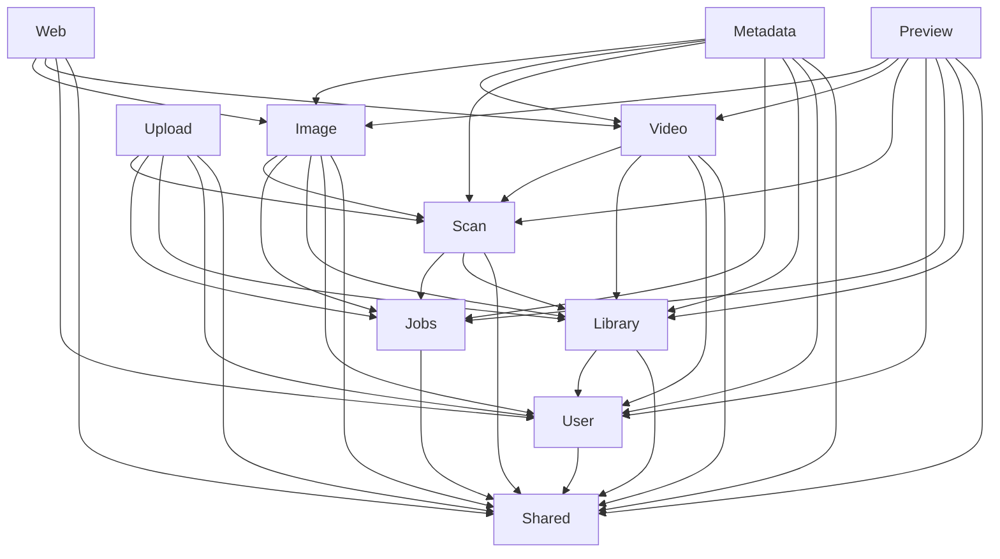
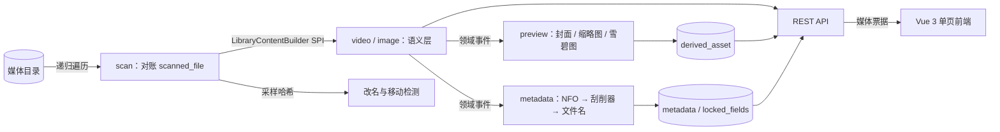

# 计划 08：交付（P13）实施计划

> **For agentic workers:** REQUIRED SUB-SKILL: Use superpowers:subagent-driven-development (recommended) or superpowers:executing-plans to implement this plan task-by-task. Steps use checkbox (`- [ ]`) syntax for tracking.

**Goal:** 把已经写完的 MyMedia 变成一个**别人克隆下来能跑、看得懂、问得倒你的交付物**：`docker compose up` 一键起（app + postgres，ffmpeg 烘焙进镜像）、自带版权安全的演示数据、README 重写、ADR 补齐到 spec §12 要求的全部主题、每个模块都有一份能对着讲的串讲稿。

**Architecture:** 本计划不新增任何后端模块、不改任何模块边界、不新增 Flyway 迁移。新增的是仓库根下的四类交付资产：`Dockerfile` + `.dockerignore`（多阶段构建，运行阶段 `eclipse-temurin:25-jre` + apt 装 ffmpeg）、`compose.yaml` 的 `app` 与 `demo-seed` 两个服务、`seed/` 与 `scripts/`（**仓库里第三方媒体零字节**，只存清单、`.nfo` 与获取脚本）、`docs/` 的七篇 ADR 与两份讲解文档，外加 `tools/screenshots/` 这个独立于主构建的截图工程。唯一的生产代码改动是关掉 G30（图片域缺分享创建入口，前端一个文件）。

**Tech Stack:** Docker Engine（本机实测 29.6.2）、`maven:3.9-eclipse-temurin-25`（构建阶段，实测存在）、`eclipse-temurin:25-jre`（运行阶段，实测 Ubuntu 26.04 LTS / OpenJDK 25.0.4+7 / 478 MB）、Compose v2、Playwright（**只在 `tools/screenshots/` 这个独立工程里**，不进 `frontend/` 也不进 Maven 生命周期）。后端与前端一律沿用既有版本，本计划不升级任何依赖。

**Spec:** `docs/superpowers/specs/2026-08-17-mymedia-design.md`（交付物见 §10，路线图 P13 见 §11，ADR 清单见 §12，版权风险见 §13）

**交接总账:** `docs/superpowers/plans/2026-08-17-00-总览与交接.md`——**执行前必须先读它的 §2（跨计划已固化的约定）、§3（已实测验证的事实）、§5（已知遗留与跨计划缺口，本计划要兑现 G14、关闭 G30、给其余缺口定稿）与 §20（本计划的设计定稿）**。

---

## Global Constraints

每个任务的要求都隐含包含本节。**违反其中任何一条都会让交付物对不上，或者让镜像构建直接失败。**

### 本计划的性质与验收方式（**先读这条，它决定你怎么判断"做完了"**）

前七份计划的验收判据是测试数字。**本计划不是**：它的产出大部分是镜像、编排、脚本与文档，判据是**命令的真实输出**——`docker build` 的退出码、`docker compose up` 之后浏览器里有没有东西、`curl` 拿到的状态码。

因此：

- **每个任务的验收步骤都必须真跑，把真实输出贴进 report。** 不允许"应该可以"。计划 05 与计划 06 都栽过同一个坑：Docker Desktop 没起就把环境失败当成代码失败（总览 §10、§11 各记了一次）。**跑任何 docker 命令之前先 `docker info` 确认守护进程在。**
- **既有的 683 个后端测试 + 68 个前端测试必须始终保持全绿。** 本计划只有 Task 9 碰生产代码；其余任务改完之后至少要跑一次 `mvn -B -ntp verify` 确认没有把构建搞坏（比如 `.dockerignore` 写错不会影响 Maven，但 `pom.xml` 手滑会）。
- **不许为了让某个演示好看而改后端行为。** 演示数据对不上就改演示数据，不改代码。

### 版本与镜像（实测值，不要凭记忆改）

| 组件 | 值 | 验证方式 |
|---|---|---|
| 构建阶段基础镜像 | `maven:3.9-eclipse-temurin-25` | 写计划时 `docker manifest inspect` 实测存在 |
| 运行阶段基础镜像 | `eclipse-temurin:25-jre` | 写计划时实跑：`Ubuntu 26.04 LTS`、`openjdk 25.0.4 2026-07-21 LTS`、`Temurin-25.0.4+7`、镜像 478 MB |
| 本机 Docker | `29.6.2` | 写计划时 `docker info` |
| jar 名 | `target/mymedia-0.0.1-SNAPSHOT.jar` | `pom.xml:12-13`（`artifactId=mymedia`、`version=0.0.1-SNAPSHOT`） |
| 跳过前端构建的开关 | `-DskipFrontend=true` | `pom.xml:20` 的 `<skipFrontend>false</skipFrontend>` + `pom.xml:182` 的 `<skip>${skipFrontend}</skip>` |

**两个必须记住的构建事实：**

1. **`-DskipTests` 只关掉后端 surefire，关不掉前端 Vitest。** `frontend-maven-plugin` 的 `npm-test` execution 绑在 `generate-resources` 阶段（`pom.xml:204-210`），跟 surefire 没关系。镜像构建阶段因此会跑一遍 Vitest——这是好事（几秒钟，不需要 Docker），但你要知道它会跑，别看见 `Test Files 8 passed` 就以为 `-DskipTests` 没生效。
2. **镜像构建阶段必须 `-DskipTests`。** 后端集成测试走 Testcontainers，构建容器里没有 Docker 守护进程，不跳过必然全挂。

### 版权纪律（硬性，spec §13 把它列为风险）

- **仓库里不得出现任何第三方媒体字节。** 只提交：清单（URL + SHA-256 + 字节数 + 许可证 + 署名）、我们自己写的 `.nfo`、以及获取脚本。
- **这条有现成的强制点**：`.gitignore` 里已有 `media/`、`derived/`、`uploads/` 三条规则，它们匹配任意层级的同名目录——所以 `data/media/` 天然被忽略，**演示媒体想误提交都提交不进去**。写计划时核对过 `.gitignore`。执行时不要为了"方便"去动这三行。
- 许可证只接受 **CC-BY / CC0 / 公有领域**。CC-BY 要求署名，所以 `seed/LICENSES.md` 里每条都必须写清作品名、作者/机构、许可证与来源 URL。
- **演示不得依赖任何 API key。** 元数据全部来自我们自己写的 `.nfo`（`LocalNfoProvider` 是提供者链的第一环，命中即停），TMDB key 留空时 `TmdbProvider` 安静降级（ADR-005）。

### 网络与外部站点

- **Wikimedia Commons 会限流。** 写计划时实测：连续四个 `curl -I` 里后两个返回 `429 Too many requests`。获取脚本**必须**带请求间隔（≥ 2 秒）与标识性 `User-Agent`，429 时退避重试。这与后端 `mymedia.metadata.min-request-interval: PT1S` 是同一条判断的第二次应用，写文档时可以对照着讲。
- **`download.blender.org` 的目录索引大部分是关的**，根目录只列 `release/` 与 `source/`。别指望列目录找文件，只能按已知路径逐个 `curl -sIL` 核实。写计划时实测：`peach/bigbuckbunny_movies/` 下的老路径已经 404，而 `durian/trailer/` 与 `peach/trailer/` 还在。
- **所有 URL 在写进清单之前都必须当场核实**，判据是 `HTTP/1.1 200` + 一个合理的 `Content-Length`。

### 既有约定（沿用，不要翻案）

- **404 而非 403**、**扫描绝不删数据**、**JSONB/TEXT[] 不做 JPA 映射**——这些本计划都不碰，但写 ADR 与串讲稿时要讲对，别把已定稿的取舍讲反了。
- **不引入 UI 组件库 / CSS 框架 / HTTP 客户端库**（前端），**不引入无法解释的中间件**（后端）。Task 8 的 Playwright 是唯一的新依赖，它靠"独立工程、不进主构建、只用来产文档资产"站住脚——**绝不能装进 `frontend/package.json`**。
- 所有面向用户的文案用中文；文档里的命令要能直接复制运行。

### 提交

- 每个任务至少一个提交，提交信息用中文，格式 `feat:` / `fix:` / `test:` / `docs:` / `refactor:` / `build:`（镜像与编排用 `build:`）。
- 文档改动与代码改动不混在同一个提交里。

---

## File Structure

### 新增

| 文件 | 职责 |
|---|---|
| `Dockerfile` | 多阶段构建：`maven:3.9-eclipse-temurin-25` 跑完前后端 → `eclipse-temurin:25-jre` + ffmpeg 作为运行镜像 |
| `.dockerignore` | 把 `target/`、`frontend/node_modules/`、`.frontend-toolchain/`、`data/`、`.git/`、`*.log`、`.superpowers/` 挡在构建上下文之外。**`node_modules` 与 `.frontend-toolchain` 装的是 Windows 二进制，漏进 Linux 构建阶段会直接把构建搞崩** |
| `.env.example` | compose 用得到的环境变量样例，含 G14 要求的固定 `MYMEDIA_SHARE_SECRET` |
| `seed/manifest.json` | 演示资产清单：每条 `{ id, kind, url, sha256, bytes, license, attribution, target }` |
| `seed/LICENSES.md` | 逐条列出作品、作者、许可证、来源 URL（CC-BY 的署名义务在这里兑现） |
| `seed/nfo/**/*.nfo` | 我们自己写的元数据文件，镜像布局与 `data/media/` 一一对应，由获取脚本复制到位 |
| `scripts/fetch-seed.sh` | Linux/macOS 版获取脚本：限速下载 → 校验 SHA-256 → 放到位 → 复制 `.nfo` → 打 CBZ |
| `scripts/fetch-seed.ps1` | Windows 版，行为与 `.sh` 完全一致（Windows 是项目所有者的主力环境，不能只给 bash 版） |
| `scripts/generate-seed-offline.sh` | 离线兜底：用 ffmpeg 现场生成一部演示"电影"、一部三集演示剧集、一个散图目录 |
| `scripts/bootstrap-demo.sh` | 空库时用**项目自己的公开 API** 建两个媒体库并触发扫描，幂等 |
| `docs/adr/ADR-009-为什么是模块化单体.md` | spec §12 第 1 条 |
| `docs/adr/ADR-010-为什么是-PostgreSQL.md` | spec §12 第 3 条 |
| `docs/adr/ADR-011-物理层与语义层分离.md` | spec §12 第 4 条 |
| `docs/adr/ADR-012-两个域的不对称组织模型.md` | spec §12 第 5 条 |
| `docs/adr/ADR-013-按领域切分-API.md` | spec §12 第 6 条 |
| `docs/adr/ADR-014-为什么不引入-Redis-Elasticsearch-与消息队列.md` | spec §12 第 9 条（三条合一，理由同源） |
| `docs/adr/ADR-015-为什么用虚拟线程.md` | spec §12 第 10 条 |
| `docs/walkthrough/08-交付.md` | 本阶段的讲解文档，体例同前七份 |
| `docs/串讲-逐模块.md` | spec §10 第 6 条约定的"项目完工后的逐模块串讲" |
| `docs/images/*.png` | README 用的八张截图 |
| `tools/screenshots/package.json` | 独立 npm 工程，pin 住 Playwright 版本 |
| `tools/screenshots/shoot.mjs` | 对着跑起来的实例截八张固定构图的图 |
| `tools/screenshots/README.md` | 怎么跑、为什么不放进 `frontend/` |

### 修改

| 文件 | 改什么 |
|---|---|
| `compose.yaml` | 加 `app` 与 `demo-seed` 两个服务、三个卷、健康检查依赖 |
| `README.md` | 整篇重写：模块图从 5 个模块改成实际的 11 个、数据流图、快速开始换成 `docker compose up`、部署清单、功能清单补 P8–P12、路线图全绿、ADR 索引补到 15 篇、八张截图 |
| `frontend/src/views/image/NodeBrowseView.vue` | Task 9：补图片域的分享创建面板（G30） |
| `docs/superpowers/plans/2026-08-17-00-总览与交接.md` | Task 11：§1 计划表标完成、§5 缺口表定稿、§6 ADR 表补 009–015、新增执行交接节与"项目完工状态" |

---

## 任务总览（11 个，三段）

| 段 | 任务 | 内容 | 分界点 |
|---|---|---|---|
| **A 一键演示** | 1–4 | 应用镜像 / compose 编排 / seed 资产与获取脚本 / 首次启动自动建库 | **Task 4 完成是一个可独立验收的分界点**：一条 `docker compose up` 之后，浏览器里应该已经有内容 |
| **B 可解释性资产** | 5–8 | ADR-009~012 / ADR-013~015 / README 重写 / 截图脚本与八张图 | Task 7 完成后 README 应当已经能独立说明整个项目 |
| **C 收口与收尾** | 9–11 | G30 图片域分享入口 / 讲解文档与逐模块串讲 / 全量验证与交接收尾 | Task 11 完成即项目完工 |

---

## Task 1：应用镜像

**Files:**
- Create: `Dockerfile`
- Create: `.dockerignore`

**Interfaces:**
- Produces：镜像内固定路径 `/app/app.jar`（可执行 jar）、`/app/data/derived`、`/app/data/uploads`、`/media`（媒体库根的挂载点）；镜像内可用命令 `ffmpeg`、`ffprobe`、`curl`、`bash`。Task 2 的 compose 与 Task 4 的引导脚本都依赖这四条路径与这四个命令。

- [ ] **Step 1: 先确认 Docker 守护进程在，再确认两个基础镜像存在**

```bash
docker info --format '{{.ServerVersion}}'
docker manifest inspect maven:3.9-eclipse-temurin-25 > /dev/null && echo "build base OK"
docker manifest inspect eclipse-temurin:25-jre > /dev/null && echo "runtime base OK"
```

预期：三条都成功。**如果 `docker info` 失败**，先把 Docker Desktop 拉起来再继续（`Start-Process "C:\Program Files\Docker\Docker\Docker Desktop.exe"`，不需要管理员权限），**不要把环境失败当成计划错误**——总览 §10、§11 各记过一次这个坑。

**如果 `maven:3.9-eclipse-temurin-25` 这个 tag 已经消失**（写计划时实测存在，但官方镜像的 tag 会退役），退路是给仓库加 Maven wrapper 并改用 `eclipse-temurin:25-jdk` 作构建阶段：

```bash
mvn -N wrapper:wrapper           # 生成 mvnw / mvnw.cmd / .mvn/wrapper/
# 然后把 Dockerfile 构建阶段的 FROM 换成 eclipse-temurin:25-jdk，
# 把 `mvn` 换成 `./mvnw`，其余一行不改
```

**走了退路就要在 report 里写明**，并且要记得 `.gitignore` 里已有 `!.mvn/wrapper/maven-wrapper.jar` 这条反向规则（wrapper 是要提交的）。

- [ ] **Step 2: 写 `.dockerignore`**

创建 `.dockerignore`：

```
# 构建产物与工具链：必须挡住。
# node_modules 与 .frontend-toolchain 在本机装的是 Windows 二进制，
# 漏进 Linux 构建阶段会让 npm/node 直接执行失败。
target/
frontend/node_modules/
frontend/dist/
.frontend-toolchain/

# 演示媒体与派生资源：几百 MB，且构建阶段完全用不到
data/

# 版本库与开发期垃圾
.git/
.gitignore
.superpowers/
.claude/
*.log

# 文档与计划：不进镜像
docs/
README.md
tools/
```

> **为什么 `docs/` 也挡掉**：构建上下文越小，`docker build` 每次传给守护进程的数据就越少。`docs/` 目前有 1.5 MB 的计划文档，进镜像没有任何用处。

- [ ] **Step 3: 写 `Dockerfile`**

创建 `Dockerfile`：

```dockerfile
# syntax=docker/dockerfile:1

# ---------- 构建阶段 ----------
# 用官方 maven 镜像而不是 JDK 镜像 + wrapper：本仓库没有 mvnw，
# 而 maven:3.9-eclipse-temurin-25 已实测存在，省掉一份要维护的 wrapper。
FROM maven:3.9-eclipse-temurin-25 AS build
WORKDIR /build

# 先只拷 pom 拉依赖，让依赖层能被后续的源码改动复用。
# -DskipFrontend=true 是必须的：这一步还没有 frontend/，
# 让前端插件跑起来只会失败。
COPY pom.xml ./
RUN mvn -B -ntp -DskipFrontend=true -DskipTests dependency:resolve

# 再拷源码。frontend-maven-plugin 会在这里下载 Node（v24.19.0）、
# 跑 npm ci → npm run test → npm run build，产物由 maven-resources-plugin
# 拷进 target/classes/static/。
COPY src ./src
COPY frontend ./frontend
# -DskipTests 只关后端 surefire（集成测试走 Testcontainers，
# 构建容器里没有 Docker 守护进程，跑不了）。
# 前端 Vitest 绑在 generate-resources 阶段，不受它影响，会照常跑完 68 条。
RUN mvn -B -ntp -DskipTests package

# ---------- 运行阶段 ----------
# eclipse-temurin:25-jre 实测是 Ubuntu 26.04 LTS / OpenJDK 25.0.4+7 / 478 MB。
FROM eclipse-temurin:25-jre AS runtime

# ffmpeg / ffprobe 烘焙进镜像（spec §10 第 1 条），
# curl 供 HEALTHCHECK 与 demo-seed 引导脚本使用。
RUN apt-get update \
    && apt-get install -y --no-install-recommends ffmpeg curl ca-certificates \
    && rm -rf /var/lib/apt/lists/*

# 不用 root 跑应用。uid 固定成 1000，方便在 Linux 上对 bind mount 调属主。
# eclipse-temurin:25-jre 的 Ubuntu 26.04 基础层自带一个 uid=1000/gid=1000 的
# 默认账号 ubuntu，直接 useradd --uid 1000 会撞车（exit 4）。执行计划 08 Task 1
# 时实测到此问题（2026-08-28），先删掉这个账号再建我们自己的：
RUN userdel -r ubuntu \
    && useradd --system --uid 1000 --shell /bin/bash --home-dir /app --create-home mymedia

WORKDIR /app
COPY --from=build /build/target/mymedia-0.0.1-SNAPSHOT.jar /app/app.jar

# derived / uploads 是应用要写的；/media 是媒体库根的挂载点。
# 三个目录都先建出来并给对属主，免得容器以非 root 启动时创建失败。
RUN mkdir -p /app/data/derived /app/data/uploads /media \
    && chown -R mymedia:mymedia /app /media

USER mymedia
EXPOSE 8080

# /actuator/health 在 SecurityConfig 里是 permitAll（SecurityConfig.java:29），
# 所以健康检查不需要凭证。start-period 给足 60 秒：首次启动要跑 V1–V16 迁移。
HEALTHCHECK --interval=10s --timeout=3s --start-period=60s --retries=12 \
    CMD curl -fsS http://localhost:8080/actuator/health || exit 1

ENTRYPOINT ["java", "-jar", "/app/app.jar"]
```

- [ ] **Step 4: 构建镜像并记录真实数字**

```bash
docker build -t mymedia:dev . > build.log 2>&1; echo "exit=$?"
tail -20 build.log
docker images mymedia:dev --format '{{.Repository}}:{{.Tag}} {{.Size}}'
```

预期：`exit=0`；日志里能看到 `Test Files 8 passed (8)` 与 `Tests 68 passed (68)`（前端 Vitest 照跑）与 `BUILD SUCCESS`；镜像大小记进 report（基础镜像 478 MB + ffmpeg 大约 250 MB + jar，量级在 700–800 MB）。

**首次构建会拉依赖与 Node，慢是正常的**（十几分钟量级）。**判定退出码不要用管道**——`docker build ... | tail` 会把退出码变成 `tail` 的 0，这是计划 07 §13.2 记录过的同一个坑。

- [ ] **Step 5: 核实运行阶段真的有 ffmpeg，且应用能起来**

> ⚠ 2026-08-28 实测更正：Dockerfile 只有 `ENTRYPOINT`、没有 `CMD`，下面 `docker run --rm
> mymedia:dev <cmd>` 这种写法**不会**执行 `<cmd>`——参数会追加在 `java -jar /app/app.jar`
> 后面而不是替换它（`docker inspect` 能看到 `Cmd=null`）。必须用 `--entrypoint` 覆盖：

```bash
docker run --rm --entrypoint ffprobe mymedia:dev -version | head -1
docker run --rm --entrypoint ffmpeg mymedia:dev -version | head -1
docker run --rm --entrypoint id mymedia:dev
```

预期：前两条各打印一行版本号；`id` 显示 `uid=1000(mymedia)`（`gid` 会是 999 不是 1000——`useradd --system` 从系统 GID 段分配，与接口契约无关，不影响任何下游任务）。**把 ffmpeg/ffprobe 的真实版本号记进 report**——它是 `mymedia.preview.*` 那一整套参数的运行前提。

- [ ] **Step 6: 提交**

```bash
git add Dockerfile .dockerignore
git commit -m "build: 应用镜像，多阶段构建并烘焙 ffmpeg"
```

---

## Task 2：compose 一键起

**Files:**
- Modify: `compose.yaml`
- Create: `.env.example`

**Interfaces:**
- Consumes：Task 1 的镜像与它固定的四条路径。
- Produces：服务名 `postgres` / `app`，网络内地址 `http://app:8080`，宿主端口 `8080`，宿主媒体目录 `./data/media` ↔ 容器 `/media`。Task 3 的获取脚本把媒体写到 `./data/media`，Task 4 的引导脚本用 `http://app:8080` 与库根路径 `/media/video`、`/media/image`。

- [ ] **Step 1: 写 `.env.example`**

创建 `.env.example`：

```dotenv
# 复制成 .env 后按需修改。compose 会自动读取同目录的 .env。

# 初始管理员。生产部署必须改掉——AdminBootstrap 只在空库时创建它。
MYMEDIA_ADMIN_USERNAME=admin
MYMEDIA_ADMIN_PASSWORD=admin

# 分享链接的 HMAC 签名密钥。**留空会导致每次重启随机生成，
# 带密码的分享链接就要让访客重新输一次密码**（这是缺口 G14）。
# 生产部署配一个固定的长随机串，例如：openssl rand -base64 48
MYMEDIA_SHARE_SECRET=replace-me-with-a-long-random-string

# 媒体票据密钥刻意不配：留空每次启动随机是**正确默认**——
# 票据 15 分钟就过期、前端会自动续签，重启的最坏结果只是多取一次票据。
# 同一个算法两种生命周期两种默认值，理由见 ADR-008。

# 可选：配了才启用 TMDB 刮削器；留空时它安静降级，不算错误（ADR-005）。
MYMEDIA_METADATA_TMDB_API_KEY=
```

> `.env.example` 提交进仓库，`.env` 不提交。**执行时确认 `.gitignore` 里已有 `.env` 这一行**（写计划时核对过，第 20 行左右有 `.env` 与 `.env.local`）。

- [ ] **Step 2: 改 `compose.yaml`**

把 `compose.yaml` 整份替换成：

```yaml
services:
  postgres:
    image: 'postgres:17'
    container_name: mymedia-postgres
    environment:
      POSTGRES_DB: mymedia
      POSTGRES_USER: mymedia
      POSTGRES_PASSWORD: mymedia
    ports:
      - '5432:5432'
    volumes:
      - mymedia-pgdata:/var/lib/postgresql/data
    healthcheck:
      test: ['CMD-SHELL', 'pg_isready -U mymedia -d mymedia']
      interval: 5s
      timeout: 5s
      retries: 10

  app:
    build: .
    image: mymedia:dev
    container_name: mymedia-app
    depends_on:
      postgres:
        condition: service_healthy
    environment:
      SPRING_DATASOURCE_URL: jdbc:postgresql://postgres:5432/mymedia
      SPRING_DATASOURCE_USERNAME: mymedia
      SPRING_DATASOURCE_PASSWORD: mymedia
      MYMEDIA_ADMIN_USERNAME: ${MYMEDIA_ADMIN_USERNAME:-admin}
      MYMEDIA_ADMIN_PASSWORD: ${MYMEDIA_ADMIN_PASSWORD:-admin}
      # G14：留空会让带密码的分享链接在重启后要求访客重输密码
      MYMEDIA_SHARE_SECRET: ${MYMEDIA_SHARE_SECRET:-replace-me-with-a-long-random-string}
      MYMEDIA_METADATA_TMDB_API_KEY: ${MYMEDIA_METADATA_TMDB_API_KEY:-}
      # 派生资源与上传临时目录都指到容器里的持久卷
      MYMEDIA_PREVIEW_ROOT: /app/data/derived
      MYMEDIA_UPLOAD_TEMP_ROOT: /app/data/uploads
    ports:
      - '8080:8080'
    volumes:
      # 媒体目录**必须可写**：Web 上传是把合并好的文件落进媒体库根目录、
      # 再触发一次增量扫描接进语义层。挂成 :ro 会把 P11 整条链路废掉。
      - ./data/media:/media
      - mymedia-derived:/app/data/derived
      - mymedia-uploads:/app/data/uploads

  # 一次性引导：等 app 健康后，用项目自己的公开 API 建库并触发扫描。
  # 幂等，跑完就退出，restart: "no" 保证它不会被反复拉起。
  demo-seed:
    image: mymedia:dev
    container_name: mymedia-demo-seed
    depends_on:
      app:
        condition: service_healthy
    restart: 'no'
    entrypoint: ['/bin/bash', '/seed/bootstrap-demo.sh']
    environment:
      BASE_URL: http://app:8080
      ADMIN_USER: ${MYMEDIA_ADMIN_USERNAME:-admin}
      ADMIN_PASS: ${MYMEDIA_ADMIN_PASSWORD:-admin}
    volumes:
      - ./scripts/bootstrap-demo.sh:/seed/bootstrap-demo.sh:ro

volumes:
  mymedia-pgdata:
  mymedia-derived:
  mymedia-uploads:
```

> **`demo-seed` 复用 app 镜像**（`image: mymedia:dev`），不引第三方 curl 镜像：Task 1 已经把 `curl` 和 `bash` 装进去了，再拉一个镜像只是多一个要解释的依赖。

- [ ] **Step 3: 建出媒体目录并起一次**

```bash
mkdir -p data/media/video data/media/image
docker compose up -d --build > up.log 2>&1; echo "exit=$?"
docker compose ps
```

预期：`exit=0`；`docker compose ps` 里 `postgres` 与 `app` 都是 `running`，`app` 的状态里带 `(healthy)`。**`demo-seed` 这一步会失败或退出非 0**——`scripts/bootstrap-demo.sh` 要到 Task 4 才存在，这是预期内的，Task 4 会补上。

- [ ] **Step 4: 核实应用真的活着**

```bash
curl -s http://localhost:8080/actuator/health
curl -s -u admin:admin http://localhost:8080/api/libraries
curl -s -o /dev/null -w '%{http_code}\n' http://localhost:8080/
```

预期：第一条 `{"status":"UP"}`；第二条 `[]`（空库，还没建）；第三条 `200`（SPA 外壳）。

- [ ] **Step 5: 核实容器里的写路径可用**

```bash
docker compose exec app sh -c 'touch /media/.write-test && rm /media/.write-test && echo media-writable'
docker compose exec app sh -c 'ls -ld /app/data/derived /app/data/uploads'
```

预期：打印 `media-writable`；两个目录属主是 `mymedia`。

**如果 `/media` 写不了**（Linux 宿主上 bind mount 会继承宿主目录的属主，容器里是 uid 1000）：宿主上执行 `sudo chown -R 1000:1000 data/media` 即可。Windows 的 Docker Desktop 不会有这个问题。**把实际遇到的情况写进 report 与 README 的部署清单。**

- [ ] **Step 6: 提交**

```bash
git add compose.yaml .env.example
git commit -m "build: compose 加 app 与 demo-seed 服务，一条命令起全套"
```

---

## Task 3：seed 资产清单与获取脚本

**Files:**
- Create: `seed/manifest.json`
- Create: `seed/LICENSES.md`
- Create: `seed/nfo/video/电影/Sintel (2010)/Sintel.nfo`
- Create: `seed/nfo/video/电影/Big Buck Bunny (2008)/Big Buck Bunny.nfo`
- Create: `seed/nfo/video/剧集/Blender 演示剧集/tvshow.nfo`
- Create: `seed/nfo/image/图集/葛饰北斋/metadata.json`
- Create: `scripts/fetch-seed.sh`
- Create: `scripts/fetch-seed.ps1`
- Create: `scripts/generate-seed-offline.sh`

**Interfaces:**
- Produces：`./data/media/video/**` 与 `./data/media/image/**` 两棵目录树，形状由 `seed/manifest.json` 的 `target` 字段决定。Task 4 的引导脚本按 `/media/video`、`/media/image` 两个库根建库。

- [ ] **Step 1: 逐条核实候选 URL，并算出 SHA-256**

清单里的每一条都必须当场核实。先跑核实：

```bash
for u in \
 "https://download.blender.org/durian/trailer/sintel_trailer-480p.mp4" \
 "https://download.blender.org/peach/trailer/trailer_480p.mov" \
 "https://upload.wikimedia.org/wikipedia/commons/0/0a/The_Great_Wave_off_Kanagawa.jpg" \
 "https://upload.wikimedia.org/wikipedia/commons/a/a5/Tsunami_by_hokusai_19th_century.jpg" ; do
  printf "%-70s " "$(basename "$u")"
  curl -sIL --max-time 20 -A "MyMedia-seed/0.1 (+https://github.com/kisima0225/MyMedia)" "$u" \
    | grep -iE "^HTTP/|content-length" | tr '\n' ' '
  echo
  sleep 2      # Wikimedia 会 429，必须限速
done
```

写计划时实测到的基线（**如果对不上，以你这次跑出来的为准，并在 report 里写明差异**）：

| URL | 状态 | Content-Length |
|---|---|---|
| `download.blender.org/durian/trailer/sintel_trailer-480p.mp4` | 200 | 4 372 373 |
| `download.blender.org/peach/trailer/trailer_480p.mov` | 200 | 11 061 011 |
| `commons/0/0a/The_Great_Wave_off_Kanagawa.jpg` | 200 | 2 684 586 |
| `commons/a/a5/Tsunami_by_hokusai_19th_century.jpg` | 200 | 2 354 187 |

**图集至少要 6 张图才像样。** 上面两张是已核实的种子，再从 Wikimedia Commons 上挑 4 张葛饰北斋或同期公有领域浮世绘补齐——挑选判据只有两条：**页面上明确标注 Public Domain**，且**单张小于 5 MB**。每加一条都按上面的命令核实一次，间隔 2 秒。

然后下载并算校验和（这一步产出写进清单的 `sha256` 与 `bytes`）：

```bash
mkdir -p /tmp/seed-probe && cd /tmp/seed-probe
curl -fsSL -A "MyMedia-seed/0.1 (+https://github.com/kisima0225/MyMedia)" -o sintel.mp4 \
  "https://download.blender.org/durian/trailer/sintel_trailer-480p.mp4"
sha256sum sintel.mp4 && stat -c '%s' sintel.mp4
```

- [ ] **Step 2: 写 `seed/manifest.json`**

用 Step 1 实测到的值填。结构固定成这样（示例里的 `sha256` 全部是占位的 64 个 `0`，**必须换成真实值**）：

```json
{
  "note": "演示资产清单。仓库里不存任何第三方媒体字节，只存这份清单、我们自己写的 .nfo 和获取脚本。许可证与署名见 seed/LICENSES.md。",
  "userAgent": "MyMedia-seed/0.1 (+https://github.com/kisima0225/MyMedia)",
  "minIntervalSeconds": 2,
  "assets": [
    {
      "id": "sintel-trailer",
      "kind": "video",
      "url": "https://download.blender.org/durian/trailer/sintel_trailer-480p.mp4",
      "sha256": "0000000000000000000000000000000000000000000000000000000000000000",
      "bytes": 4372373,
      "license": "CC BY 3.0",
      "attribution": "Sintel（预告片）© Blender Foundation | durian.blender.org",
      "target": "video/电影/Sintel (2010)/Sintel.mp4"
    },
    {
      "id": "bbb-trailer",
      "kind": "video",
      "url": "https://download.blender.org/peach/trailer/trailer_480p.mov",
      "sha256": "0000000000000000000000000000000000000000000000000000000000000000",
      "bytes": 11061011,
      "license": "CC BY 3.0",
      "attribution": "Big Buck Bunny（预告片）© Blender Foundation | peach.blender.org",
      "target": "video/电影/Big Buck Bunny (2008)/Big Buck Bunny.mov"
    },
    {
      "id": "hokusai-great-wave",
      "kind": "image",
      "url": "https://upload.wikimedia.org/wikipedia/commons/0/0a/The_Great_Wave_off_Kanagawa.jpg",
      "sha256": "0000000000000000000000000000000000000000000000000000000000000000",
      "bytes": 2684586,
      "license": "Public Domain",
      "attribution": "神奈川冲浪里 · 葛饰北斋（1831 前后）| Wikimedia Commons",
      "target": "image/图集/葛饰北斋/01.jpg"
    },
    {
      "id": "hokusai-tsunami",
      "kind": "image",
      "url": "https://upload.wikimedia.org/wikipedia/commons/a/a5/Tsunami_by_hokusai_19th_century.jpg",
      "sha256": "0000000000000000000000000000000000000000000000000000000000000000",
      "bytes": 2354187,
      "license": "Public Domain",
      "attribution": "葛饰北斋（19 世纪）| Wikimedia Commons",
      "target": "image/图集/葛饰北斋/02.jpg"
    }
  ],
  "archives": [
    {
      "id": "hokusai-cbz",
      "target": "image/漫画/葛饰北斋画集.cbz",
      "pages": ["hokusai-great-wave", "hokusai-tsunami"],
      "note": "CBZ 由脚本用上面这些已下载的公有领域图片现打，仓库里不存归档文件本身。"
    }
  ]
}
```

**`pages` 至少要凑到 6 条**，把 Step 1 补齐的那几张一并列进去——一本只有两页的漫画演示不出阅读器的双页模式与连续滚动。

- [ ] **Step 3: 写 `seed/LICENSES.md`**

```markdown
# 演示数据的许可证与署名

本仓库**不包含任何第三方媒体文件**。`scripts/fetch-seed.*` 按 `seed/manifest.json`
从下列来源获取，校验 SHA-256 后放进 `data/media/`（该目录被 `.gitignore` 里的
`media/` 规则忽略，媒体文件不会进入版本库）。

CC BY 要求署名，下表就是署名。

| 作品 | 作者 / 机构 | 许可证 | 来源 |
|---|---|---|---|
| Sintel（预告片） | Blender Foundation | CC BY 3.0 | https://download.blender.org/durian/trailer/sintel_trailer-480p.mp4 |
| Big Buck Bunny（预告片） | Blender Foundation | CC BY 3.0 | https://download.blender.org/peach/trailer/trailer_480p.mov |
| 神奈川冲浪里 | 葛饰北斋（1831 前后） | 公有领域 | https://commons.wikimedia.org/wiki/File:The_Great_Wave_off_Kanagawa.jpg |
| （其余按 manifest.json 逐条补全） | | | |

`scripts/generate-seed-offline.sh` 生成的占位媒体由 ffmpeg 的 `testsrc` 合成，
不含任何第三方素材，无许可证约束。
```

- [ ] **Step 4: 写 `.nfo`（我们自己写的，可以进仓库）**

`seed/nfo/video/电影/Sintel (2010)/Sintel.nfo`：

```xml
<?xml version="1.0" encoding="UTF-8"?>
<movie>
  <title>Sintel</title>
  <originaltitle>Sintel</originaltitle>
  <year>2010</year>
  <plot>Blender 基金会的第三部开源电影。本演示库收录的是官方预告片（CC BY 3.0）。</plot>
  <genre>动画</genre>
  <studio>Blender Foundation</studio>
</movie>
```

`seed/nfo/video/电影/Big Buck Bunny (2008)/Big Buck Bunny.nfo`：

```xml
<?xml version="1.0" encoding="UTF-8"?>
<movie>
  <title>Big Buck Bunny</title>
  <originaltitle>Big Buck Bunny</originaltitle>
  <year>2008</year>
  <plot>Blender 基金会的第二部开源电影。本演示库收录的是官方预告片（CC BY 3.0）。</plot>
  <genre>动画</genre>
  <studio>Blender Foundation</studio>
</movie>
```

`seed/nfo/video/剧集/Blender 演示剧集/tvshow.nfo`：

```xml
<?xml version="1.0" encoding="UTF-8"?>
<tvshow>
  <title>Blender 演示剧集</title>
  <plot>由 scripts/generate-seed-offline.sh 用 ffmpeg 合成的三集彩条片，
        专门用来演示文件名解析（S01E01 形式）、剧集分组与继续观看。</plot>
  <studio>MyMedia 演示数据</studio>
</tvshow>
```

`seed/nfo/image/图集/葛饰北斋/metadata.json`：

```json
{
  "title": "葛饰北斋画集",
  "originalTitle": "葛飾北斎",
  "summary": "公有领域浮世绘，用于演示图片域的节点树、瀑布流与阅读器。",
  "tags": ["浮世绘", "公有领域"]
}
```

> **`.nfo` 的查找顺序**是 `LocalNfoProvider` 定的：同名 `.nfo` → `movie.nfo` → `tvshow.nfo` → `metadata.json`，命中即停。上面四份分别覆盖了"同名"、"剧集"与"项目自有格式"三种入口，演示时能把提供者链的第一环讲清楚。**执行前用 `grep -n "movie.nfo\|tvshow.nfo\|metadata.json" src/main/java/com/mymedia/metadata/*.java` 核对一遍实际的查找顺序，不要凭这段话写。**

- [ ] **Step 5: 写 `scripts/fetch-seed.sh`**

```bash
#!/usr/bin/env bash
# 按 seed/manifest.json 获取演示媒体。幂等：已存在且校验和相符的条目直接跳过。
set -euo pipefail

ROOT="$(cd "$(dirname "$0")/.." && pwd)"
MANIFEST="$ROOT/seed/manifest.json"
MEDIA="$ROOT/data/media"
NFO="$ROOT/seed/nfo"
UA="MyMedia-seed/0.1 (+https://github.com/kisima0225/MyMedia)"
INTERVAL=2

command -v jq >/dev/null || { echo "需要 jq：https://jqlang.github.io/jq/"; exit 1; }

fetch_one() {
  local url="$1" sha="$2" target="$3"
  local dest="$MEDIA/$target"
  if [ -f "$dest" ] && [ "$(sha256sum "$dest" | cut -d' ' -f1)" = "$sha" ]; then
    echo "跳过（已存在且校验和相符）：$target"
    return 0
  fi
  mkdir -p "$(dirname "$dest")"
  echo "下载：$target"
  curl -fL --retry 3 --retry-delay 5 -A "$UA" -o "$dest.part" "$url"
  local actual
  actual="$(sha256sum "$dest.part" | cut -d' ' -f1)"
  if [ "$actual" != "$sha" ]; then
    rm -f "$dest.part"
    echo "校验和不符：$target" >&2
    echo "  期望 $sha" >&2
    echo "  实际 $actual" >&2
    exit 1
  fi
  mv "$dest.part" "$dest"
  sleep "$INTERVAL"
}

# 1. 逐条下载
while IFS=$'\t' read -r url sha target; do
  fetch_one "$url" "$sha" "$target"
done < <(jq -r '.assets[] | [.url, .sha256, .target] | @tsv' "$MANIFEST")

# 2. 打 CBZ：用已经下载好的公有领域图片现打，仓库里不存归档
while IFS=$'\t' read -r target pages; do
  dest="$MEDIA/$target"
  if [ -f "$dest" ]; then echo "跳过（已存在）：$target"; continue; fi
  mkdir -p "$(dirname "$dest")"
  tmp="$(mktemp -d)"
  i=1
  for id in $pages; do
    src="$MEDIA/$(jq -r --arg id "$id" '.assets[] | select(.id==$id) | .target' "$MANIFEST")"
    cp "$src" "$(printf '%s/%03d.jpg' "$tmp" "$i")"
    i=$((i + 1))
  done
  if command -v zip >/dev/null; then
    (cd "$tmp" && zip -q -r "$dest" .)
  else
    (cd "$tmp" && python3 -c "import shutil,sys; shutil.make_archive(sys.argv[1],'zip','.')" "${dest%.cbz}")
    mv "${dest%.cbz}.zip" "$dest"
  fi
  rm -rf "$tmp"
  echo "已打包：$target"
done < <(jq -r '.archives[] | [.target, (.pages | join(" "))] | @tsv' "$MANIFEST")

# 3. 把我们自己写的 .nfo 复制到媒体目录里（它们必须和媒体文件放在一起）
if [ -d "$NFO" ]; then
  (cd "$NFO" && find . -type f -exec sh -c 'mkdir -p "$0/$(dirname "$1")" && cp "$1" "$0/$1"' "$MEDIA" {} \;)
  echo "已复制 .nfo"
fi

echo
echo "完成。媒体目录："
find "$MEDIA" -type f | sort
```

跑一次并 `chmod +x`：

```bash
chmod +x scripts/fetch-seed.sh
./scripts/fetch-seed.sh
```

预期：所有条目下载成功、CBZ 打出来、`.nfo` 就位，最后打印出完整的文件清单。**再跑一次**，预期全部打印"跳过"——幂等性必须实测。

- [ ] **Step 6: 写 `scripts/fetch-seed.ps1`（Windows 版，行为一致）**

> ⚠ 2026-08-28 实测更正：下面这份模板在 Windows PowerShell 5.1（`$PSVersionTable.PSVersion`
> 实测 `5.1.22621.6060`，项目所有者的实际环境）上有两处真 bug，已在下方代码里改好：
> 1. `Invoke-WebRequest -MaximumRetryCount`/`-RetryIntervalSec` 是 PowerShell 6+ 才有的参数，
>    5.1 里 `Get-Command Invoke-WebRequest` 找不到，直接报错——改成手写重试循环。
> 2. 脚本源码本身没有 UTF-8 BOM 时，5.1 会按系统 ANSI 代码页（中文系统是 GBK/GB2312）解析
>    源码，脚本里写死的中文字符串字面量会乱码（"下载" 变成 "涓嬭浇"）——文件必须带 UTF-8 BOM
>    (`EF BB BF`) 保存。

```powershell
# 按 seed/manifest.json 获取演示媒体。幂等：已存在且校验和相符的条目直接跳过。
$ErrorActionPreference = 'Stop'

$root = Split-Path -Parent $PSScriptRoot
$manifest = Get-Content "$root/seed/manifest.json" -Raw -Encoding utf8 | ConvertFrom-Json
$media = Join-Path $root 'data/media'
$nfo = Join-Path $root 'seed/nfo'
$ua = $manifest.userAgent
$interval = $manifest.minIntervalSeconds

foreach ($a in $manifest.assets) {
    $dest = Join-Path $media $a.target
    if ((Test-Path $dest) -and ((Get-FileHash $dest -Algorithm SHA256).Hash.ToLower() -eq $a.sha256)) {
        Write-Output "跳过（已存在且校验和相符）：$($a.target)"
        continue
    }
    New-Item -ItemType Directory -Force -Path (Split-Path -Parent $dest) | Out-Null
    Write-Output "下载：$($a.target)"
    # -MaximumRetryCount/-RetryIntervalSec 是 PS 6+ 参数，5.1 没有，手写重试循环替代
    for ($attempt = 1; $attempt -le 4; $attempt++) {
        try {
            Invoke-WebRequest -Uri $a.url -OutFile "$dest.part" -UserAgent $ua
            break
        } catch {
            if ($attempt -eq 4) { throw }
            Start-Sleep -Seconds 5
        }
    }
    $actual = (Get-FileHash "$dest.part" -Algorithm SHA256).Hash.ToLower()
    if ($actual -ne $a.sha256) {
        Remove-Item "$dest.part" -Force
        throw "校验和不符：$($a.target)`n  期望 $($a.sha256)`n  实际 $actual"
    }
    Move-Item "$dest.part" $dest -Force
    Start-Sleep -Seconds $interval
}

foreach ($ar in $manifest.archives) {
    $dest = Join-Path $media $ar.target
    if (Test-Path $dest) { Write-Output "跳过（已存在）：$($ar.target)"; continue }
    New-Item -ItemType Directory -Force -Path (Split-Path -Parent $dest) | Out-Null
    $tmp = Join-Path ([System.IO.Path]::GetTempPath()) ([System.Guid]::NewGuid().ToString())
    New-Item -ItemType Directory -Force -Path $tmp | Out-Null
    $i = 1
    foreach ($id in $ar.pages) {
        $src = Join-Path $media (($manifest.assets | Where-Object { $_.id -eq $id }).target)
        Copy-Item $src (Join-Path $tmp ('{0:d3}.jpg' -f $i))
        $i++
    }
    # Compress-Archive 是 PowerShell 自带的，不需要装 zip
    Compress-Archive -Path (Join-Path $tmp '*') -DestinationPath "$dest.zip" -Force
    Move-Item "$dest.zip" $dest -Force
    Remove-Item $tmp -Recurse -Force
    Write-Output "已打包：$($ar.target)"
}

if (Test-Path $nfo) {
    Copy-Item -Path (Join-Path $nfo '*') -Destination $media -Recurse -Force
    Write-Output "已复制 .nfo"
}

Write-Output ''
Write-Output '完成。媒体目录：'
Get-ChildItem $media -Recurse -File | ForEach-Object { $_.FullName }
```

**在 Windows PowerShell 5.1 上真跑一次**（这是项目所有者的实际环境）：

```powershell
powershell -ExecutionPolicy Bypass -File .\scripts\fetch-seed.ps1
```

- [ ] **Step 7: 写 `scripts/generate-seed-offline.sh`（离线兜底）**

```bash
#!/usr/bin/env bash
# 离线兜底：不联网，用 ffmpeg 现场合成演示媒体。
# 可以在容器里跑（镜像里已经有 ffmpeg）：
#   docker compose run --rm --user root --entrypoint bash app /seed/generate-seed-offline.sh
# 也可以在本机跑（要求本机有 ffmpeg）。
set -euo pipefail

MEDIA="${MEDIA_ROOT:-/media}"
command -v ffmpeg >/dev/null || { echo "找不到 ffmpeg"; exit 1; }

make_clip() {   # $1=输出路径 $2=秒数 $3=左上角文字
  mkdir -p "$(dirname "$1")"
  [ -f "$1" ] && { echo "跳过（已存在）：$1"; return 0; }
  ffmpeg -y -loglevel error \
    -f lavfi -i "testsrc=size=640x360:rate=24:duration=$2" \
    -f lavfi -i "sine=frequency=440:duration=$2" \
    -vf "drawtext=text='$3':fontcolor=white:fontsize=28:x=24:y=24" \
    -c:v libx264 -pix_fmt yuv420p -c:a aac -shortest "$1"
  echo "已生成：$1"
}

# 一部"电影"
make_clip "$MEDIA/video/电影/演示影片 (2026)/演示影片.mp4" 20 "DEMO MOVIE"

# 一部三集"剧集"——文件名刻意用 S01E01 形式，用来演示解析与分组
for e in 1 2 3; do
  make_clip "$MEDIA/video/剧集/Blender 演示剧集/Season 01/S01E0${e} - 第 ${e} 集.mp4" 15 "S01E0${e}"
done

# 一个散图目录（不打 CBZ：容器里没有 zip，而图片域本来就原生支持散图目录）
DIR="$MEDIA/image/图集/演示图集"
mkdir -p "$DIR"
made_any=0
for p in $(seq -w 1 12); do
  [ -f "$DIR/$p.jpg" ] && continue
  ffmpeg -y -loglevel error -f lavfi -i "testsrc=size=800x1200:rate=1:duration=1" \
    -vf "drawtext=text='PAGE $p':fontcolor=white:fontsize=64:x=(w-tw)/2:y=(h-th)/2" \
    -frames:v 1 "$DIR/$p.jpg"
  made_any=1
done
# ⚠ 2026-08-28 实测更正：原稿这里是无条件 echo "已生成"，幂等重跑（12 张全部被上面的
# continue 跳过）时也会打印"已生成"，措辞和实际行为对不上——用 made_any 标志位区分。
if [ "$made_any" = 1 ]; then
  echo "已生成：$DIR（12 页散图）"
else
  echo "跳过（已存在）：$DIR（12 页散图）"
fi

echo
echo "完成。离线演示数据就绪。"
```

跑一次验证（本机有 ffmpeg 就本机跑，没有就在容器里跑）：

```bash
chmod +x scripts/generate-seed-offline.sh
MEDIA_ROOT=./data/media ./scripts/generate-seed-offline.sh
# 或者：
docker compose run --rm --user root --entrypoint bash \
  -v "$PWD/scripts/generate-seed-offline.sh:/seed/generate-seed-offline.sh:ro" \
  app /seed/generate-seed-offline.sh
```

预期：`data/media/video/电影/演示影片 (2026)/`、`.../剧集/Blender 演示剧集/Season 01/` 下三个文件、`.../image/图集/演示图集/` 下 12 张图。**再跑一次全部打印"跳过"。**

> **为什么离线路径不打 CBZ**：容器里没有 `zip`，为了演示装一个包不划算；而图片域本来就原生支持散图目录（`image_node` 的 `directPageCount` 与 `readable` 就是为这个建模的）。CBZ 的演示留给在线路径。**这条差异要写进 README 与 Task 10 的讲解文档，别让人以为离线模式漏了功能。**

- [ ] **Step 8: 确认媒体确实没进版本库**

```bash
git status --porcelain data/ | head
git check-ignore -v data/media/video/电影/Sintel\ \(2010\)/Sintel.mp4
```

预期：第一条**无输出**；第二条打印出命中的忽略规则（`.gitignore` 里的 `media/`）。**这一步是版权纪律的实测，不能跳。**

- [ ] **Step 9: 提交**

```bash
git add seed/ scripts/fetch-seed.sh scripts/fetch-seed.ps1 scripts/generate-seed-offline.sh
git commit -m "feat: 演示数据清单、获取脚本与离线兜底生成器"
```

---

## Task 4：首次启动自动建库

**Files:**
- Create: `scripts/bootstrap-demo.sh`
- Modify: `compose.yaml`（如果 Task 2 里的 `demo-seed` 服务定义需要微调）

**Interfaces:**
- Consumes：Task 2 的 `BASE_URL` / `ADMIN_USER` / `ADMIN_PASS` 三个环境变量；Task 3 产出的 `/media/video` 与 `/media/image` 两棵目录树。
- Produces：两个媒体库（名字固定为 `演示视频库` / `演示图片库`），各自触发过一次扫描。

> **为什么用脚本调 API，而不是写一个 `SeedBootstrap` Java 类**：引导需要同时用 `library`（建库）与 `scan`（触发扫描）两个模块的能力，而现有 11 个模块里没有一个的 `allowedDependencies` 同时允许这两条边——为演示逻辑去动模块图，代价远大于收益。用项目自己的公开 API 完成引导，零生产代码、零模块边界风险，而且"引导过程本身就是一次 API 演示"是个能讲的点。这与 `AdminBootstrap` 的取舍不同：那个只碰 `user` 一个模块，写成 Java 是自然的。

- [ ] **Step 1: 写 `scripts/bootstrap-demo.sh`**

```bash
#!/usr/bin/env bash
# 空库时用项目自己的公开 API 建两个演示媒体库并触发扫描。幂等。
# 由 compose 的 demo-seed 服务在 app 健康之后运行一次。
set -euo pipefail

BASE="${BASE_URL:-http://app:8080}"
USER="${ADMIN_USER:-admin}"
PASS="${ADMIN_PASS:-admin}"

api() { curl -fsS -u "$USER:$PASS" -H 'Content-Type: application/json' "$@"; }

echo "等待 $BASE 就绪…"
for i in $(seq 1 60); do
  if curl -fsS "$BASE/actuator/health" >/dev/null 2>&1; then break; fi
  sleep 2
done

existing="$(api "$BASE/api/libraries")"

create_and_scan() {   # $1=库名 $2=域 $3=根路径
  # 没有 jq 也要能判断：库名是我们自己定的固定字符串，grep 足够可靠
  if printf '%s' "$existing" | grep -q "\"name\":\"$1\""; then
    echo "跳过（已存在）：$1"
    return 0
  fi
  echo "建库：$1（$2 → $3）"
  local created
  created="$(api -X POST "$BASE/api/libraries" \
    -d "{\"name\":\"$1\",\"domain\":\"$2\",\"rootPath\":\"$3\"}")"
  # 响应形如 {"id":1,"name":"演示视频库","domain":"VIDEO","rootPath":"/media/video","enabled":true}
  local id
  id="$(printf '%s' "$created" | sed -n 's/.*"id":\([0-9]\+\).*/\1/p')"
  [ -n "$id" ] || { echo "没能从响应里解析出库 id：$created" >&2; exit 1; }
  echo "触发扫描：库 id=$id"
  api -X POST "$BASE/api/libraries/$id/scan" >/dev/null
}

create_and_scan "演示视频库" "VIDEO" "/media/video"
create_and_scan "演示图片库" "IMAGE" "/media/image"

echo "引导完成。"
```

> **请求体的形状是从后端抄来的，不要改**：`LibraryDto.CreateRequest(name, domain, rootPath)`，三个字段都有校验（`@NotBlank` / `@NotNull` / `@NotBlank`）；建库端点 `POST /api/libraries` 返回 `201` 与 `LibraryDto.Response(id, name, domain, rootPath, enabled)`；扫描端点是 `POST /api/libraries/{id}/scan`，返回 `202` 与 `{"jobId":…,"status":"ACCEPTED"}`。两个端点都要求 `ADMIN` 角色。**执行前用 `sed -n '70,85p' src/main/java/com/mymedia/library/LibraryController.java` 和 `cat src/main/java/com/mymedia/scan/ScanController.java` 核对一遍，别凭这段话写。**

- [ ] **Step 2: 从全新状态起一次整套**

```bash
chmod +x scripts/bootstrap-demo.sh
docker compose down -v            # 清掉卷，模拟别人第一次克隆
docker compose up -d --build > up.log 2>&1; echo "exit=$?"
docker compose logs demo-seed
```

预期：`demo-seed` 的日志里依次出现"建库：演示视频库"、"触发扫描：库 id=1"、"建库：演示图片库"、"触发扫描：库 id=2"、"引导完成。"，容器退出码 0。

- [ ] **Step 3: 等扫描跑完，核实真的扫进去了**

```bash
sleep 30
curl -s -u admin:admin http://localhost:8080/api/libraries
curl -s -u admin:admin "http://localhost:8080/api/video/items?libraryId=1" | head -c 400; echo
curl -s -u admin:admin "http://localhost:8080/api/image/nodes?libraryId=2" | head -c 400; echo
```

预期：两个库都在；视频库里能看到 Sintel、Big Buck Bunny 与三集剧集；图片库里能看到图集节点。**具体端点路径以实际代码为准**——用 `grep -rn "@GetMapping" src/main/java/com/mymedia/video/web/ src/main/java/com/mymedia/image/web/ | head -20` 找准了再敲。

**如果扫描没扫到东西**，按这个顺序查：① 容器里 `ls -R /media` 有没有文件；② `docker compose logs app | grep -i 扫描`；③ 库的 `rootPath` 是不是写成了宿主路径而不是容器路径。

- [ ] **Step 4: 幂等性实测**

```bash
docker compose up -d --force-recreate demo-seed
docker compose logs --tail 20 demo-seed
```

预期：两条都打印"跳过（已存在）"，不重复建库。

- [ ] **Step 5: 浏览器里过一遍**

打开 `http://localhost:8080`，用 `admin/admin` 登录，逐条确认：

| 检查项 | 判据 |
|---|---|
| 视频首页有卡片 | 至少两部电影 + 一部剧集，卡片有封面（不是占位图） |
| 点进去能播 | 网络面板出现 `206 Partial Content` |
| 进度条悬停出预览帧 | 雪碧图生成完之后才有，可能要等一会儿 |
| 图片首页有书卡 | 书卡左缘能看到 4px 书脊 |
| 能进阅读器 | 满幅纸色，翻页正常 |
| 元数据来自 `.nfo` | 条目详情里的简介是我们写的那段中文 |

**这一步必须人工看**，看不到就回头查，不要写"应该没问题"。

- [ ] **Step 6: 提交**

```bash
git add scripts/bootstrap-demo.sh compose.yaml
git commit -m "feat: 首次启动用自己的 API 建演示库并触发扫描"
```

---

## Task 5：ADR-009 ~ ADR-012

**Files:**
- Create: `docs/adr/ADR-009-为什么是模块化单体.md`
- Create: `docs/adr/ADR-010-为什么是-PostgreSQL.md`
- Create: `docs/adr/ADR-011-物理层与语义层分离.md`
- Create: `docs/adr/ADR-012-两个域的不对称组织模型.md`

**Interfaces:**
- Consumes：既有八篇 ADR 的体例——**六个小节固定为 `状态` / `背景` / `决策` / `理由` / `后果` / `备选方案`**，`状态` 一行写"已接受（日期，实施计划 NN）"。写之前先 `cat docs/adr/ADR-006-中文搜索的真实边界.md` 对一遍格式。
- Produces：ADR-009 ~ ADR-012 四个编号，Task 11 要把它们登记进总览 §6 与 README 的 ADR 索引。

> **共同要求：每一篇都必须引用仓库里的真实证据**（文件路径、类名、迁移编号、实测数字），不许写成泛泛的技术散文。这四篇是面试里最可能被追问的四个点，"我当时是这么判断的，证据在这儿"比任何漂亮话都值钱。

- [ ] **Step 1: 写 ADR-009 为什么是模块化单体**

必须覆盖：

- **背景**：单实例自托管、开发者只有一个人、spec §2 把"微服务"列进非目标（理由是"为什么拆"这个问题现阶段答不了）。
- **决策**：顶层包即模块，用 Spring Modulith 的 `@ApplicationModule` + 显式 `allowedDependencies` 声明依赖，`ApplicationModules.verify()` 在测试阶段强制。
- **理由（这一段是全篇的核心）**：普通分层单体不是错的，它错在**没有强制点**——边界靠自觉，三个月后必然被"就这一次"侵蚀。模块化单体把边界变成**测试期会失败的断言**，成本只是一个注解。要写进去的实证：总览 §3 记录的那次实验——把 `video` 的 `allowedDependencies` 收成 `{"shared"}`，`ModularityTests` 立刻报出 11 条越界依赖（`library`、`scan`、`scan :: spi`、`scan :: events`）。**这条实证是"它真的会拦人"的唯一证据，必须写。**
- **后果**：跨模块只能走公开 API 与命名接口（`scan::spi` / `scan::events` 这种形式）；实现类与 repository 默认 package-private；想让 `scan` 不依赖领域模块就只能做 SPI 倒置（`LibraryContentBuilder`）；命名接口的名字写错不是断言失败而是**加载期异常**，整批架构测试一起挂。
- **备选方案**：微服务（过度设计，且"为什么拆"答不了）；普通分层单体（无强制点）；六边形/整洁架构的完整仪式（对这个规模是负担）。
- **附一张当前 11 个模块的依赖表**（从 `package-info.java` 抄，别凭记忆）：

| 模块 | allowedDependencies |
|---|---|
| `shared` | （空） |
| `user` | `shared` |
| `jobs` | `shared` |
| `library` | `shared`, `user` |
| `scan` | `shared`, `library`, `jobs` |
| `video` | `shared`, `user`, `library`, `scan`, `scan::spi`, `scan::events` |
| `image` | `shared`, `user`, `library`, `jobs`, `scan`, `scan::spi`, `scan::events` |
| `preview` | `shared`, `library`, `jobs`, `user`, `scan`, `scan::events`, `video`, `video::events`, `image`, `image::events` |
| `metadata` | `shared`, `user`, `library`, `jobs`, `scan`, `scan::events`, `video`, `video::events`, `image`, `image::events` |
| `upload` | `shared`, `user`, `library`, `jobs`, `scan` |
| `web` | `shared`, `user`, `video`, `image` |

- [ ] **Step 2: 写 ADR-010 为什么是 PostgreSQL**

这一篇的写法是**逐个特性对照**，不要写成"PG 更强大"。本项目实际用到的 PostgreSQL 特性，每条都指出落点：

| 特性 | 落点 | MySQL 8.0 的情况 |
|---|---|---|
| `JSONB` | `video_item.metadata` / `raw_metadata` / `field_sources`，异构刮削结果直接存 | 有 `JSON` 类型，但没有 GIN 索引这套 |
| `FOR UPDATE SKIP LOCKED` | `job` 表的抢占（V4 + `JobQueue`），ADR-003 的地基 | 8.0 起也有 |
| 部分唯一索引 | `job.dedup_key` 只在 `PENDING`/`RUNNING` 上唯一（`V4__jobs.sql:23`），这正是"同一个包在上一轮成功之后可以再排一次"的实现 | **没有**，只能靠额外列 + 触发器模拟 |
| `pg_trgm` + GIN | 中文子串搜索（ADR-006） | **没有**，要么全表扫要么上外部搜索引擎 |
| 生成列 + `to_tsvector` | `V12__search_columns.sql` 的英文全文检索路径 | 有生成列，**没有 tsvector** |
| `TEXT[]` | `libraries.metadata_providers` | **没有数组类型**，只能拆表或存 JSON |
| 复合外键 + `UNIQUE (id, domain)` | 域分区的数据库级强制（ADR-001） | 支持，但没有 `CHECK` 之外的表达优势 |

结论要写清楚：**七条里 MySQL 只能干净覆盖两条**。后果是 SQL 绑定 PG 方言（`JdbcTemplate` 里写死了 `CAST(? AS jsonb)`、`SKIP LOCKED`、`similarity()`），换库等于重写数据访问层——这个代价我们明确接受，因为交付形态就是自带 postgres 容器的 compose。

备选方案：MySQL（上表）、SQLite（单文件很诱人，但没有 `SKIP LOCKED`，任务队列就不成立）、加一个专门的搜索引擎（见 ADR-014）。

- [ ] **Step 3: 写 ADR-011 物理层与语义层分离**

- **决策**：`scanned_file` 是物理层（路径、大小、mtime、采样哈希、状态），`video_item` / `video_file` / `image_node` 是语义层，两层之间只有外键，没有合并。
- **理由**：媒体库最常见的用户操作是**整理**——改名、移动、重新归类。如果只有一层，改名 = 删除 + 新建，用户的播放进度、阅读进度、收藏、标签全部丢失。分成两层之后，改名检测（采样哈希，ADR-007）只要认出"还是那个物理文件"，`scanned_file.id` 保持不变，挂在它上面的一切就都还在。
- **实证**：`RelocationDetector` 的改名匹配；`ImageTreeRelocator` 用一条前缀替换 UPDATE 把整棵子树搬走（总览 §9 的 P2/P7 两次修复就是这条路径上的真实缺陷）；进度表挂的是文件 id 而不是路径。
- **后果**：两层需要对账（`ScanReconciler`），而对账会产生孤儿（语义条目的文件全没了），所以要有收尾器（`VideoScanFinalizer` / `ImageScanFinalizer`）；**扫描绝不删除数据**，文件消失只标 `MISSING`——所有"回收"逻辑都建立在这个前提上。
- **备选方案**：单层模型（改名即丢进度）；用绝对路径当主键（移动即丢）；每次扫描全量哈希（正确但慢，ADR-007 已经算过这笔账）。

- [ ] **Step 4: 写 ADR-012 两个域的不对称组织模型**

- **决策**：视频域是**语义树**（`video_item` / `video_group` / `collection`，文件名解析出 S01E01 这类结构），图片域是**自由树**（`image_node` 物化路径，目录结构就是用户的整理结果，外加 `reading_mode` 让用户覆盖判定）。两者不共享模型，只共享 `shared` 里的 `NaturalSortKey` 与 `MaterializedPath` 两个算法。
- **理由**：视频有稳定且广泛遵守的命名约定，解析它有真实收益；漫画与图集没有——"一本书"可能是一个 CBZ、一个装满散图的目录、或者一个装着若干章节目录的目录，强行套一套语义模型只会让 `reading_mode` 这种覆盖开关变成常态而不是例外。
- **这条判断一路贯穿到前端**：视频域用等高 16:9 网格（视频封面天然 16:9，裁切无损），图片域用 CSS 多列瀑布流（漫画封面比例天差地别，裁成统一会把标题和角色脸切掉）。**同一条判断在数据层和表现层各表达了一次**，这是这篇 ADR 最值钱的部分。
- **后果**：两个域的服务、控制器、DTO 大面积逐字对称重复（搜索、收藏、分享各一套）。计划 06 的最终审查明确把这条记为**刻意取舍**而不是坏味道：抽公共模块会引入"目标类型"多态列，而本项目一直在避免那个方向（`share_link` 的多态外键替代方案就是同一条判断）。
- **备选方案**：统一"媒体条目"模型 + `type` 字段（会长出一堆 nullable 列与 if/else）；给图片域也套语义解析（`reading_mode` 覆盖开关会从例外变成常态）。

- [ ] **Step 5: 核对与提交**

```bash
ls docs/adr/
grep -c "" docs/adr/ADR-009-*.md docs/adr/ADR-010-*.md docs/adr/ADR-011-*.md docs/adr/ADR-012-*.md
git add docs/adr/
git commit -m "docs: ADR-009~012 模块化单体、PostgreSQL 选型、分层与域不对称"
```

预期：四个文件都在，每篇 40 行以上（既有八篇的体量是 23–97 行）。

---

## Task 6：ADR-013 ~ ADR-015

**Files:**
- Create: `docs/adr/ADR-013-按领域切分-API.md`
- Create: `docs/adr/ADR-014-为什么不引入-Redis-Elasticsearch-与消息队列.md`
- Create: `docs/adr/ADR-015-为什么用虚拟线程.md`

- [ ] **Step 1: 写 ADR-013 按领域切分 API**

- **决策**：`/api/video/**` 与 `/api/image/**` 两套端点，而不是一套 `/api/media?type=video`。唯一的交汇点是 `GET /api/search`，而且**结果分区返回、不混排**（未命中的一边是空数组而不是省略字段）。
- **理由**：两个域的响应形状本来就不同——视频条目要带剧集列表与分组结构，图片节点要带页数、`readable`/`browsable` 双入口与阅读模式。一套带 `type` 的端点等于把两种形状塞进一个 DTO，客户端拿到手第一件事还是 `if (type === …)`，抽象没有省掉判断，只是把它挪到了更差的位置。
- **实证**：`GlobalSearchDto.Response(query, video, image)` 与 `GlobalSearchControllerTest` 里那条"分区不混排"的用例；前端 `api/video.ts` 与 `api/image.ts` 分立、没有共用的"媒体"抽象。
- **后果**：控制器逐字对称重复（收藏、搜索、分享各两套）；`MAX_LIMIT = 100` 这样的常量在三个控制器里各写一遍——计划 06 的 review 明确把它记为 deferred Minor 并给了理由（不为几行重复代码搭抽象）。
- **备选方案**：统一端点 + `type` 参数；GraphQL（为一个自托管单实例引入一整套查询语言，"为什么"答不了）。

- [ ] **Step 2: 写 ADR-014 为什么不引入 Redis / Elasticsearch / 消息队列**

三条合成一篇，因为**理由同源**：单实例部署 + 可解释性优先 + PostgreSQL 已经覆盖。逐条写：

| 想引入的 | 本项目的替代 | 落点 |
|---|---|---|
| 消息队列 | `job` 表 + `FOR UPDATE SKIP LOCKED` + 租约 + 退避重试 | V4 迁移、`JobQueue`、`JobScheduler`；详见 ADR-003 |
| Elasticsearch | `pg_trgm` 子串路径 + `tsvector` 英文全文路径，分层排序 | V12 迁移、`VideoSearchService` / `ImageSearchService`；边界见 ADR-006 |
| Redis | Spring 自带的 `ConcurrentMapCacheManager`（刮削结果缓存）；会话根本不存在（HTTP Basic 无状态，ADR-002） | 计划 05 Task 10 的 provider 缓存 |

**这一篇最该写清楚的是"什么时候该改主意"**，给出可判定的触发条件：

- 消息队列：出现第二个实例、或者需要跨进程的扇出订阅；**任务量本身不是理由**——`SKIP LOCKED` 在单实例上能扛的量远超一个自托管媒体库。
- Elasticsearch：语料量级到百万条、或者需要同义词/拼音/分词器这类真正的检索能力。ADR-006 已经量化了当前的上界：10 万行表上两字中文查询退化成全表扫，29 ms。
- Redis：出现多实例需要共享缓存、或者缓存需要淘汰策略与持久化（当前 provider 缓存**没有淘汰策略**，这是记在案的缺口 G18）。

**后果**要写实**：单实例是硬约束，横向扩展时上面三条都要重估；provider 缓存会随进程生命周期无限增长。

- [ ] **Step 3: 写 ADR-015 为什么用虚拟线程**

- **决策**：`spring.threads.virtual.enabled: true`（`application.yml`），任务调度器与外部进程读取都显式用虚拟线程工厂。
- **实证（三处，都要指名道姓）**：
  1. `JobScheduler.java:37` 用 `Thread.ofVirtual().name("mymedia-job-", 0).factory()` 建任务执行器；
  2. `JobScheduler.java:39` 的租约续期线程同样是虚拟线程；
  3. `ProcessCommandRunner.java:64` 用 `Thread.ofVirtual().start(...)` 读子进程的 stdout/stderr——**这一处不是为了性能，是为了正确性**：不并发读走管道，ffmpeg 输出把管道写满就会死锁。
- **理由**：本项目是彻头彻尾的阻塞 I/O 场景——大文件 Range 流式传输、ZIP 随机读单页、外部进程调用、刮削 HTTP 请求。虚拟线程正好对这个形状：一个请求一个线程的写法保住了（栈追踪可读、调试简单），而阻塞不再占着平台线程。JDK 25 是 LTS，虚拟线程早已转正。
- **坑（写出来才显得是真用过）**：`synchronized` 块里阻塞会 pin 住载体线程（JDK 24 起 JEP 491 大幅缓解，但 `synchronized` + 阻塞 I/O 仍然值得避开）；把连接池/对象池挂在 `ThreadLocal` 上的老套路在虚拟线程下失效（线程是海量且短命的）；线程转储要用 `jcmd Thread.dump_to_file -format=json`，老的 `jstack` 看不到虚拟线程。
- **后果**：不需要调 Tomcat 线程池大小；数据库连接池反而成了新的瓶颈点（虚拟线程可以无限多，连接不行）——**这一条要老实写，它是虚拟线程最常见的误用**。
- **备选方案**：平台线程池（要调参、要在吞吐与内存之间猜）；响应式 WebFlux（把整个代码库变成回调/操作符风格，换来的是同一个场景下虚拟线程已经解决的问题——对一个要求"每一处都能解释"的项目是负分）。

- [ ] **Step 4: 提交**

```bash
git add docs/adr/
git commit -m "docs: ADR-013~015 按领域切分 API、不引入中间件、虚拟线程"
```

---

## Task 7：README 重写

**Files:**
- Modify: `README.md`

> **README 现在有三处是过期的**，写计划时逐条核对过：① `## 架构` 一节说"当前由 `shared`、`user`、`library`、`jobs`、`scan` 五个模块组成"，实际是 11 个；② 同一节的 mermaid 图只有 5 个节点；③ `## 已实现功能` 停在计划 04（缺预览、刮削、搜索、标签、收藏、分享、上传、前端），`## 路线图` 还写着"后续阶段按以下顺序推进：P3…P13"，而 P3–P12 全都做完了。前端相关的三段（界面预览、前端开发模式）是计划 07 补的，是新的，别删。

- [ ] **Step 1: 重写 `## 快速开始`**

第一条命令换成一键起，并把两条路径写清楚：

````markdown
## 快速开始

要求本机装了 Docker（Compose v2）。**不需要装 JDK、Maven、Node 或 ffmpeg**——都在镜像里。

```bash
git clone https://github.com/kisima0225/MyMedia.git
cd MyMedia
cp .env.example .env          # 按需改管理员账号与分享密钥
./scripts/fetch-seed.sh       # Windows: powershell -ExecutionPolicy Bypass -File .\scripts\fetch-seed.ps1
docker compose up -d --build
```

首次构建要拉依赖并下载 Node，十几分钟量级；之后重启是秒级。起来之后打开
<http://localhost:8080>，用 `.env` 里的账号登录——演示媒体库已经由 `demo-seed`
服务自动建好并扫描过了。

**没有网络？** 跳过 `fetch-seed`，改用离线兜底，用镜像里自带的 ffmpeg 现场合成演示媒体：

```bash
docker compose up -d --build
docker compose run --rm --user root --entrypoint bash \
  -v "$PWD/scripts/generate-seed-offline.sh:/seed/gen.sh:ro" app /seed/gen.sh
docker compose up -d --force-recreate demo-seed
```

离线模式生成的是彩条视频与带页码的散图，**不含 CBZ**（容器里没有 zip，
而图片域本来就原生支持散图目录）——CBZ 的演示需要在线路径。
````

- [ ] **Step 2: 重写 `## 架构` 一节的模块表述与图**

把"五个模块"改成下面这段，mermaid 图整个替换（**依赖关系直接从 `package-info.java` 抄，已核对**）：

````markdown
这是一个模块化单体，而不是按服务拆分的微服务。顶层包就是模块，当前有
`shared` / `user` / `library` / `jobs` / `scan` / `video` / `image` / `preview` /
`metadata` / `upload` / `web` 十一个；实现类和 repository 默认保持 package-private，
跨模块只依赖公开 API 与命名接口（`scan::spi`、`scan::events` 这种形式）。
依赖方向写在每个模块 `package-info.java` 的 `allowedDependencies` 上，由
`ApplicationModules.verify()` 在测试阶段强制——把 `video` 的声明收成 `{"shared"}`
会立刻报出 11 条越界依赖，这个强制点是真的会拦人的。为什么选模块化单体见
[ADR-009](docs/adr/ADR-009-为什么是模块化单体.md)。



**图里最值得看的是没有的那些箭头**：`video` 与 `image` 之间没有边（两个域互不依赖，
只共享 `shared` 里的算法）；`video`/`image` 指向 `preview`/`metadata` 的反向边不存在
（预览与刮削是订阅领域事件的下游，依赖严格单向）；`scan` 不指向任何领域模块
（靠 `LibraryContentBuilder` 这个 SPI 倒置，加第三个域不用改扫描代码）。
````

- [ ] **Step 3: 加一张数据流图**

在模块图之后补一节，讲清一个文件从磁盘走到浏览器的完整路径：

````markdown
### 一个文件是怎么走到浏览器里的



三条值得注意的性质：**物理层与语义层是分开的**（改名不丢进度，见
[ADR-011](docs/adr/ADR-011-物理层与语义层分离.md)）；**派生资源可以整个删掉重建**
（`derived_asset` 不含用户数据）；**刮削是可选增强**，找不到不是错误（
[ADR-005](docs/adr/ADR-005-刮削是可选增强.md)）。
````

- [ ] **Step 4: 补 `## 已实现功能`**

在既有列表末尾追加 P8–P12 的条目（**逐条对着代码核实，别抄计划文档的措辞**）：

```markdown
- ffprobe 探测与视频封面抽帧、缩略图
- 进度条雪碧图（固定 100 帧、单张 10×10）与 WebVTT
- 元数据提供者链：本地 NFO → 配置的刮削器（Bangumi / TMDB）→ 文件名兜底
- 字段级来源记录与用户编辑锁定（`locked_fields`）
- 刮削待确认队列与确认 / 忽略
- 双路径搜索：pg_trgm 子串匹配 + tsvector 英文全文检索，分层排序
- 全局搜索结果按域分区返回，不混排
- 标签、收藏（视频条目与图片节点）
- 免登录分享链接，可选密码与有效期
- 分片上传、断点续传、秒传
- Vue 3 单页前端：两个域两套视觉语言、播放器、三模式漫画阅读器、管理界面
- 短期签名媒体票据，让 `<video>` / `` 在无状态认证下也能取流
```

- [ ] **Step 5: 重写 `## 路线图`**

```markdown
## 路线图

设计文档 [§11 实施路线图](docs/superpowers/specs/2026-08-17-mymedia-design.md#11-实施路线图)
的 P0–P13 已全部完成，对应八份实施计划（见
[总览与交接](docs/superpowers/plans/2026-08-17-00-总览与交接.md)）。

| 阶段 | 内容 | 状态 |
|---|---|---|
| P0–P2 | 骨架 / 认证 / 媒体库 / 任务队列 | ✅ |
| P3 | 扫描框架、对账、采样哈希改名检测 | ✅ |
| P4–P5 | 视频域、目录树、Range 播放、播放进度 | ✅ |
| P6–P7 | 图片域节点树、CBZ 流式阅读、阅读进度 | ✅ |
| P8–P9 | 预览生成与元数据刮削 | ✅ |
| P10–P11 | 搜索、标签、收藏、分享、分片上传 | ✅ |
| P12 | 响应式前端 | ✅ |
| P13 | seed 数据、README、ADR、讲解文档 | ✅ |
| P14 | *可选*：转码 / HLS | 明确不做，理由见设计文档 §2 |
```

- [ ] **Step 6: 加 `## 部署清单`（G14 在这里兑现）**

```markdown
## 部署清单

自用之外的部署，逐条过一遍：

| 项 | 怎么做 | 不做的后果 |
|---|---|---|
| 改掉默认管理员 | `.env` 里改 `MYMEDIA_ADMIN_USERNAME` / `MYMEDIA_ADMIN_PASSWORD` | `admin/admin` 是公开的 |
| **配固定的分享密钥** | `.env` 里 `MYMEDIA_SHARE_SECRET` 填一个长随机串（`openssl rand -base64 48`） | **留空则每次启动随机生成，重启后带密码的分享链接会要求访客重新输密码** |
| 媒体票据密钥 | 刻意不配 | 无后果：票据 15 分钟过期且前端自动续签，重启最多多取一次票据（见 ADR-008） |
| TMDB key | 需要刮削英文影视才配 `MYMEDIA_METADATA_TMDB_API_KEY` | 留空则该刮削器安静降级，不算错误 |
| 数据卷备份 | `mymedia-pgdata` 必须备；`mymedia-derived` 可以不备（删掉能由任务队列全量重建） | — |
| 媒体目录属主 | Linux 宿主上 `chown -R 1000:1000 data/media`（容器里以 uid 1000 运行） | 上传与扫描写不进去 |
| 反向代理 | 自行配置；应用本身只监听 8080，不做 TLS | — |
```

- [ ] **Step 7: 更新 ADR 索引**

把 `## ADR 索引` 补成 15 条，每条一句话说明它回答的问题。

- [ ] **Step 8: 校对与提交**

```bash
grep -n "五个模块" README.md            # 预期无输出
grep -c "ADR-0" README.md               # 预期 ≥ 15
git add README.md
git commit -m "docs: 重写 README，模块图与功能清单对齐 11 个模块与 P13"
```

---

## Task 8：截图脚本与八张图

**Files:**
- Create: `tools/screenshots/package.json`
- Create: `tools/screenshots/shoot.mjs`
- Create: `tools/screenshots/README.md`
- Create: `docs/images/*.png`（八张）
- Modify: `README.md`（把截图插进 `### 界面预览` 一节，替换现在的纯文字描述）

> **为什么放在 `tools/` 而不是 `frontend/`**：`frontend/package.json` 现在只有 3 个运行时依赖和 6 个开发依赖，这个极简是刻意的（计划 07 的 Global Constraints 明写"不引组件库、不引 CSS 框架、不引 HTTP 客户端库"）。Playwright 会往 `npm ci` 里加一大块，而它跟前端本身一点关系都没有——它是**产文档资产的工具**。放进 `tools/` 并且不接进 Maven 生命周期，主构建一秒都不会变慢。

- [ ] **Step 1: 写 `tools/screenshots/package.json`**

```json
{
  "name": "mymedia-screenshots",
  "version": "0.0.1",
  "private": true,
  "type": "module",
  "description": "给 README 产截图的独立工具，不属于前端工程，也不进 Maven 构建",
  "scripts": {
    "shoot": "node shoot.mjs"
  },
  "devDependencies": {
    "playwright": "1.58.2"
  }
}
```

> **版本要当场核实**：`npm view playwright version`，用实际的最新稳定版并**写死**（不写 `^`），与 `frontend/` 的锁版本纪律一致。

- [ ] **Step 2: 写 `tools/screenshots/shoot.mjs`**

```javascript
// 对着一个跑起来的 MyMedia 实例截 README 用的八张图。
// 用法：
//   npm i && npx playwright install chromium
//   node shoot.mjs --base http://localhost:8080 --user admin --pass admin
import { chromium } from 'playwright'
import { mkdir } from 'node:fs/promises'
import { dirname, resolve } from 'node:path'
import { fileURLToPath } from 'node:url'

const arg = (name, fallback) => {
  const i = process.argv.indexOf(`--${name}`)
  return i >= 0 ? process.argv[i + 1] : fallback
}

const BASE = arg('base', 'http://localhost:8080')
const USER = arg('user', 'admin')
const PASS = arg('pass', 'admin')
const OUT = resolve(dirname(fileURLToPath(import.meta.url)), '../../docs/images')

// 八张图，每张都定死页面与状态。顺序即 README 里的出现顺序。
const SHOTS = [
  { file: '01-视频首页.png', path: '/video', wait: '.card, .video-card' },
  { file: '02-条目详情.png', path: '/video', click: '.card a, .video-card a' },
  { file: '03-播放器.png', path: null, hoverScrubBar: true },
  { file: '04-图片首页.png', path: '/image', wait: '.book-card, .spine' },
  { file: '05-阅读器.png', path: '/image', openReader: true },
  { file: '06-全局搜索.png', path: '/search?q=e', wait: 'main' },
  { file: '07-媒体库管理.png', path: '/admin/libraries', wait: 'table, .library-table' },
  { file: '08-分片上传.png', path: '/admin/upload', wait: 'main' },
]

const run = async () => {
  await mkdir(OUT, { recursive: true })
  const browser = await chromium.launch()
  const context = await browser.newContext({
    viewport: { width: 1440, height: 900 },
    deviceScaleFactor: 2,
    httpCredentials: { username: USER, password: PASS },
  })
  const page = await context.newPage()

  // 前端用 HTTP Basic，凭证存在 sessionStorage 里；直接走登录页最稳。
  await page.goto(`${BASE}/login`)
  await page.fill('input[type="text"], input[name="username"]', USER)
  await page.fill('input[type="password"]', PASS)
  await page.click('button[type="submit"]')
  await page.waitForURL((u) => !u.pathname.startsWith('/login'), { timeout: 15000 })

  for (const shot of SHOTS) {
    if (shot.path) await page.goto(`${BASE}${shot.path}`)
    if (shot.wait) await page.waitForSelector(shot.wait, { timeout: 15000 }).catch(() => {})
    if (shot.click) await page.click(shot.click).catch(() => {})
    if (shot.openReader) {
      await page.click('.book-card a, .card a').catch(() => {})
      await page.click('text=开始阅读').catch(() => {})
    }
    if (shot.hoverScrubBar) {
      await page.click('text=播放').catch(() => {})
      await page.waitForTimeout(3000)
      const bar = await page.$('.scrub-bar, [class*="scrub"]')
      if (bar) {
        const box = await bar.boundingBox()
        if (box) await page.mouse.move(box.x + box.width * 0.4, box.y + box.height / 2)
      }
      await page.waitForTimeout(500)
    }
    await page.waitForTimeout(1200)   // 等封面与字体加载完
    await page.screenshot({ path: resolve(OUT, shot.file), fullPage: false })
    console.log(`已截图：${shot.file}`)
  }

  await browser.close()
}

run().catch((err) => {
  console.error(err)
  process.exit(1)
})
```

> **选择器是按计划 07 的组件命名猜的**，执行时**必须**先打开页面看真实的 class 再改。核对命令：
> `grep -rn "class=\"" frontend/src/components/video/VideoCard.vue frontend/src/components/image/BookCard.vue frontend/src/components/video/ScrubBar.vue | head -20`
> 每个 `waitForSelector` 都带了 `.catch(() => {})`，找不到不会崩，但会截出一张空图——**逐张肉眼看过再提交**。

- [ ] **Step 3: 写 `tools/screenshots/README.md`**

说明三件事：怎么跑（先 `docker compose up` 起实例，再 `npm i && npx playwright install chromium && npm run shoot`）、为什么不放进 `frontend/`、以及产物落在 `docs/images/`。

- [ ] **Step 4: 真跑一次**

```bash
cd tools/screenshots
npm install > install.log 2>&1; echo "exit=$?"
npx playwright install chromium > pw.log 2>&1; echo "exit=$?"
node shoot.mjs --base http://localhost:8080 --user admin --pass admin
ls -la ../../docs/images/
```

预期：八个 PNG，每个几百 KB。**逐张打开看**——空白图、停在登录页的图、加载骨架屏的图都要重截。

**如果这个环境起不了 Chromium**（计划 07 的交接记录了本环境无浏览器自动化能力，很可能还是起不来）：**脚本照常提交**，`docs/images/` 留空，README 里的图片引用先注释掉并写明"跑 `tools/screenshots` 即可生成"，然后**在 report 里明确写"截图未产出，需要项目所有者在本机跑一次"**。不要伪造截图，也不要因此把脚本删掉——脚本本身就是交付物的一部分。

- [ ] **Step 5: 把截图插进 README**

替换 `### 界面预览` 现在那段纯文字描述（保留文字，图放在文字上方）：

```markdown
### 界面预览

| | |
|---|---|
|  |  |
| 视频首页：冷色底 + 彩色外发光卡片 | 播放器：悬停进度条从雪碧图换帧，零额外请求 |
|  |  |
| 图片首页：暖色底 + 落影 + 4px 书脊，瀑布流不裁切封面 | 阅读器：全应用唯一的亮面，满幅纸色 |
```

- [ ] **Step 6: 提交**

```bash
git add tools/screenshots/ docs/images/ README.md
git commit -m "docs: 截图工具与 README 界面预览"
```

---

## Task 9：G30 图片域分享入口

**Files:**
- Modify: `frontend/src/views/image/NodeBrowseView.vue`

**Interfaces:**
- Consumes：`createShare(kind, id, body)`（`frontend/src/api/shares.ts`），签名是 `(kind: 'video' | 'image', id: number, body: { password?: string; expiresInDays?: number }) => Promise<ShareLink>`；响应体里有 `token`。
- Produces：无（纯界面补齐）。

> **这是本计划唯一的生产代码改动。** 缺口 G30：后端 `POST /api/image/nodes/{id}/share` 早就存在，视频域的 `ItemDetailView.vue`（计划 07 Task 9）也早就接了，只有图片域没有对称实现——计划 07 的全分支 final review 发现，当时判定"最后一轮修复没有独立 review 兜底，风险偏高"而只记账没修。现在有完整的 review 流程，补上它。

- [ ] **Step 1: 在 `<script setup>` 里加分享状态与两个函数**

在 `NodeBrowseView.vue` 的 `<script setup>` 末尾（`onReadingModeChange` 之后）追加。**这段是从 `ItemDetailView.vue:110-163` 搬来的，只改了两处**：`createShare('video', …)` → `createShare('image', …)`，`detail.value.item.id` → `node.value.id`：

```typescript
const shareOpen = ref(false)
const sharePassword = ref('')
const shareExpiresInDaysInput = ref('')
const shareBusy = ref(false)
const shareErrorText = ref<string | null>(null)
const shareLink = ref<string | null>(null)
const shareCreated = ref(false)
const copyStatus = ref<'idle' | 'copied' | 'failed'>('idle')

const COPY_STATUS_LABEL: Record<typeof copyStatus.value, string> = {
  idle: '复制链接',
  copied: '已复制',
  failed: '复制失败',
}
const copyButtonLabel = computed(() => COPY_STATUS_LABEL[copyStatus.value])

function toggleSharePanel(): void {
  shareOpen.value = !shareOpen.value
}

async function submitShare(): Promise<void> {
  if (!node.value || shareBusy.value) return
  shareBusy.value = true
  shareErrorText.value = null
  try {
    const body: { password?: string; expiresInDays?: number } = {}
    const password = sharePassword.value.trim()
    if (password) body.password = password
    const daysText = shareExpiresInDaysInput.value.trim()
    if (daysText) {
      const days = Number(daysText)
      if (Number.isFinite(days)) body.expiresInDays = days
    }
    const response = await createShare('image', node.value.id, body)
    shareLink.value = `${location.origin}/s/${response.token}`
    shareCreated.value = true
    copyStatus.value = 'idle'
  } catch (err) {
    shareErrorText.value = err instanceof Error ? err.message : '创建分享链接失败，请重试'
  } finally {
    shareBusy.value = false
  }
}

async function copyShareLink(): Promise<void> {
  if (!shareLink.value) return
  try {
    await navigator.clipboard.writeText(shareLink.value)
    copyStatus.value = 'copied'
  } catch {
    copyStatus.value = 'failed'
  }
}
```

并把 import 补上（`computed` 已经在导入列表里了，只需要加 `createShare`）：

```typescript
import { createShare } from '@/api/shares'
```

- [ ] **Step 2: 切换节点时重置分享面板**

`NodeBrowseView` 会在 `watch(nodeId, load)` 时换成另一个节点，**分享状态必须跟着重置**，否则用户会在 B 节点的页面上看到 A 节点的链接。在 `load()` 函数体开头（`status.value = 'loading'` 那几行旁边）追加：

```typescript
  shareOpen.value = false
  shareCreated.value = false
  shareLink.value = null
  sharePassword.value = ''
  shareExpiresInDaysInput.value = ''
  shareErrorText.value = null
  copyStatus.value = 'idle'
```

> **`ItemDetailView.vue` 没有这一段**，因为它每次都是整页重新挂载。`NodeBrowseView` 靠 `watch` 复用同一个组件实例，所以这一段是必须的——**这是本任务与"照抄"的唯一实质差别，review 时要专门看这里。**

- [ ] **Step 3: 在模板里加按钮与面板**

放在 `header-row` 之后、`banner` 之前。按钮不能嵌进任何 `RouterLink`（计划 07 Task 12 的 review 抓过一次交互元素嵌套的无障碍缺陷）：

```vue
      <div class="share-row">
        <button type="button" class="action" @click="toggleSharePanel">分享这个节点</button>
      </div>

      <div v-if="shareOpen" class="share-panel">
        <template v-if="!shareCreated">
          <label class="field">
            <span>密码（可选）</span>
            <input v-model="sharePassword" type="password" placeholder="留空表示不设密码" />
          </label>
          <label class="field">
            <span>有效天数（可选，1–365）</span>
            <input
              v-model="shareExpiresInDaysInput"
              type="number"
              min="1"
              max="365"
              placeholder="留空表示永不过期"
            />
          </label>
          <button type="button" class="action primary" :disabled="shareBusy" @click="submitShare">
            创建分享链接
          </button>
          <p v-if="shareErrorText" class="hint error">{{ shareErrorText }}</p>
        </template>
        <template v-else>
          <p class="hint success">已创建分享链接</p>
          <div class="share-link-row">
            <code class="share-link">{{ shareLink }}</code>
            <button type="button" class="action" @click="copyShareLink">
              {{ copyButtonLabel }}
            </button>
          </div>
        </template>
      </div>
```

- [ ] **Step 4: 补样式**

`<style scoped>` 里追加（**从 `ItemDetailView.vue:365-418` 搬来，一个值都不改**——两个域的令牌名相同、取值不同，同一套 CSS 在图片域会自动变成暖色，这正是设计体系起作用的证据）：

```css
.share-row {
  margin-bottom: var(--space-4);
}

.share-panel {
  display: flex;
  flex-direction: column;
  gap: var(--space-3);
  max-width: 28em;
  margin-bottom: var(--space-5);
  padding: var(--space-4);
  border: 1px solid var(--line);
  border-radius: var(--radius);
  background: var(--raised);
}

.field {
  display: flex;
  flex-direction: column;
  gap: var(--space-1);
  font-size: var(--step--1);
  color: var(--dim);
}

.field input {
  padding: var(--space-2);
  border: 1px solid var(--line);
  border-radius: var(--radius);
  background: var(--ground);
  color: var(--text);
  font-family: var(--font-body);
  font-size: var(--step-0);
}

.field input:focus {
  outline: none;
  border-color: var(--accent);
}

.share-link-row {
  display: flex;
  align-items: center;
  gap: var(--space-3);
}

.share-link {
  flex: 1;
  min-width: 0;
  padding: var(--space-2);
  border-radius: var(--radius);
  background: var(--ground);
  font-family: var(--font-data);
  font-size: var(--step--1);
  color: var(--text);
  overflow-x: auto;
  white-space: nowrap;
}
```

**`.action` / `.action.primary` / `.hint` 三个类要先确认在这个文件里存不存在**：

```bash
grep -n "\.action\|\.hint" frontend/src/views/image/NodeBrowseView.vue
```

不存在就一并从 `ItemDetailView.vue` 搬过来（`grep -n -A 20 "^\.action" frontend/src/views/video/ItemDetailView.vue`）。**别指望它们是全局样式**——计划 07 的惯例是每个 SFC 自带样式。

- [ ] **Step 5: 类型检查与构建**

```bash
cd frontend
npx vue-tsc -b --force > tsc.log 2>&1; echo "exit=$?"; head -20 tsc.log
npx vite build > build.log 2>&1; echo "exit=$?"; tail -5 build.log
npx vitest run > vt.log 2>&1; echo "exit=$?"; tail -6 vt.log
```

预期：三个 `exit=0`；Vitest 仍是 `8 passed / 68 passed`（本任务按既定约定不写组件渲染测试）。

**判定退出码不要用管道**——`npx vue-tsc … | tail` 会把退出码变成 `tail` 的 0，类型错误被静默吞掉。这是计划 07 记录在案的坑。

- [ ] **Step 6: 浏览器里实测一遍**

起着的实例上，进任意图片节点页：

| 检查项 | 判据 |
|---|---|
| 按钮在 | 面包屑下方有"分享这个节点" |
| 面板能开合 | 点两次能收起来 |
| 不设密码创建 | 出现完整链接，形如 `http://localhost:8080/s/<token>` |
| 复制按钮 | 点了变"已复制" |
| 链接真能用 | **无痕窗口**打开该链接，不登录也能看到内容 |
| 切换节点后重置 | 创建完链接再点进子节点，面板是收起的、没有残留链接 |
| 视觉是暖色 | 面板背景与边框跟着图片域令牌走，不是视频域的冷色 |

最后一条和倒数第二条**是本任务真正的风险点**，务必亲自看。

- [ ] **Step 7: 提交**

```bash
git add frontend/src/views/image/NodeBrowseView.vue
git commit -m "feat: 图片域补分享创建入口，关闭 G30"
```

---

## Task 10：讲解文档与逐模块串讲

**Files:**
- Create: `docs/walkthrough/08-交付.md`
- Create: `docs/串讲-逐模块.md`

- [ ] **Step 1: 写 `docs/walkthrough/08-交付.md`**

按前七份的体例（这一段做了什么、为什么这么做、坑在哪）。必须覆盖：

1. **为什么镜像是多阶段的**，以及为什么运行阶段选 `eclipse-temurin:25-jre` 而不是 alpine（Temurin 官方没有 25 的 alpine 变体，而且 ffmpeg 在 musl 上要自己编）。带上实测数字：基础镜像 478 MB、装完 ffmpeg 之后的实际大小。
2. **`-DskipTests` 关不掉前端测试**这个反直觉点：Vitest 绑在 `generate-resources` 阶段，跟 surefire 没关系。顺带讲为什么镜像构建阶段必须跳过后端测试（Testcontainers 要 Docker，构建容器里没有）。
3. **`.dockerignore` 里最重要的两行**：`frontend/node_modules/` 与 `.frontend-toolchain/` 装的是 Windows 二进制，漏进 Linux 构建阶段会以"node: not found"之类的怪错误崩掉，排查起来极费时间。
4. **媒体卷为什么不能挂 `:ro`**：上传链路是"落进媒体库根目录 + 触发增量扫描"，只读会把 P11 整条废掉。这一条能顺带讲清楚 `upload` 模块为什么依赖 `scan`。
5. **引导为什么用 shell + curl 而不是 Java**：需要同时用 `library` 与 `scan`，没有哪个模块的 `allowedDependencies` 允许这条组合；为演示逻辑动模块图不划算。**对照 `AdminBootstrap`**——它只碰 `user` 一个模块，所以写成 Java 是自然的。同一个问题，两种答案，差别只在于跨了几个模块。
6. **版权纪律怎么变成机器可执行的**：仓库零第三方媒体字节，`.gitignore` 里的 `media/` 规则是强制点，`git check-ignore` 是它的实测方式；SHA-256 校验让"下到的东西是不是清单里那个"变成可判定的。
7. **Wikimedia 的 429**：写计划时连续四个 `curl -I` 后两个就被限流了。这与后端 `mymedia.metadata.min-request-interval` 是同一条判断的第二次应用——**凡是打别人的服务器，都要自带节流**。
8. **离线兜底为什么不打 CBZ**：容器里没有 zip，而图片域原生支持散图目录。这不是缺功能，是选了一条不需要新依赖的路。
9. **截图工具为什么在 `tools/` 而不是 `frontend/`**：`frontend/` 的极简依赖是刻意的；产文档资产的工具不该出现在应用的依赖树里。
10. **本阶段关掉的缺口与仍然留账的缺口**：G14（部署清单）、G30（图片域分享入口）已关；G18–G29 的现状与"什么时候该动它们"。

- [ ] **Step 2: 写 `docs/串讲-逐模块.md`**

spec §10 第 6 条约定的"项目完工后的逐模块串讲"。**这份文档的读者是项目所有者本人**，用途是对着它把项目讲一遍、并且答得出追问。

结构固定：开头一段"怎么用这份文档"，然后每个模块一节，共 12 节（11 个后端模块 + 前端）。每节三块：

```markdown
## N. <模块名>

**它解决什么问题**：两三句话，说清没有它会怎样。

**关键设计**：2–4 条，每条一句话 + 落点（类名/迁移/文件）。

**最可能被追问的三个问题**

| 问题 | 怎么答 |
|---|---|
| … | …（答案里要带具体证据：实测数字、类名、或者一个 ADR 编号） |
```

十二节的问题清单（**每一节都必须写满三个问题，不许留空**）：

| 模块 | 三个追问方向 |
|---|---|
| `shared` | 为什么 `SampledHash` 从 `scan` 提到这里而不是一开始就放这里（第二个消费者出现时才提取）；`NaturalSortKey` 解决什么问题（`第2章` 排在 `第10章` 前面）；`HmacSigner` 为什么被两套票据共用 |
| `user` | 为什么是 HTTP Basic（ADR-002）；密码怎么存的（bcrypt）；`AdminBootstrap` 为什么是幂等的、以及它跟 demo-seed 引导的分工 |
| `library` | 域分区为什么在数据库层强制（ADR-001，`UNIQUE (id, domain)` + 复合外键）；无权访问为什么返回 404 而不是 403；分享链接的多态目标为什么不用多态外键 |
| `jobs` | 为什么不用消息队列（ADR-003 / ADR-014）；`FOR UPDATE SKIP LOCKED` 怎么保证不重复抢占；租约与退避重试怎么处理"worker 死了" |
| `scan` | 为什么扫描不依赖领域模块（SPI 倒置）；文件消失为什么只标 `MISSING` 不删；改名检测为什么用采样哈希而不是全量（ADR-007，含它会漏的情况） |
| `video` | 文件名解析到什么程度就该停；Range 请求的完整语义（含多重 Range 返回并集这个定稿）；进度为什么挂在文件而不是路径 |
| `image` | 为什么是自由树而不是语义树（ADR-012）；CBZ 怎么做到"绝不解压到磁盘"；物化路径在目录改名时怎么一条 UPDATE 搬走整棵子树 |
| `preview` | 雪碧图为什么固定 100 帧 10×10；为什么探测必须先于抽帧；派生资源为什么可以整个删掉重建 |
| `metadata` | 提供者链为什么不做 SPI 倒置（ADR-004）；`locked_fields` 与链顺序各管什么（不要引入第三套 tier 比较）；置信度用的二元组 Dice 与 `pg_trgm` 的三元组有什么区别 |
| `upload` | 为什么绕开 multipart 直接收二进制分片；秒传的三条边界（ADR-007）；同名文件为什么永不覆盖 |
| `web` | 为什么只有全局搜索放这里；结果为什么分区不混排（ADR-013）；SPA 的 history fallback 与安全白名单怎么不打架 |
| 前端 | 为什么不引组件库/CSS 框架/axios；媒体票据为什么只在三条只读路径上被接受（ADR-008）；两个域的视觉语言怎么用一套 CSS 令牌表达两种物理隐喻 |

- [ ] **Step 3: 提交**

```bash
git add docs/walkthrough/08-交付.md docs/串讲-逐模块.md
git commit -m "docs: 交付讲解文档与逐模块串讲"
```

---

## Task 11：全量验证、交付自检与交接收尾

**Files:**
- Modify: `docs/superpowers/plans/2026-08-17-00-总览与交接.md`

- [ ] **Step 1: 后端与前端全量验证**

```bash
docker info --format '{{.ServerVersion}}'     # 先确认守护进程在
mvn -B -ntp clean verify > final.log 2>&1; echo "exit=$?"
grep -E "Tests run: [0-9]+, Failures|BUILD " final.log | tail -3
```

预期：`BUILD SUCCESS`；后端 **683 tests / 0 failures / 0 errors / 2 skipped**（计划 07 合并进 `main` 时的基线，本计划只有 Task 9 碰前端代码，后端数字不该变），前端 **8 files / 68 tests**。**把真实数字写进交接，不要写"约"。**

两个 skipped 是既有的环境门控用例（本机无 ffprobe、Windows 无符号链接权限），不是回归。

- [ ] **Step 2: 从零走一遍完整交付流程**

**这一步是本计划的核心验收**，模拟一个人第一次克隆这个仓库：

```bash
docker compose down -v
rm -rf data/media
./scripts/fetch-seed.sh
docker compose up -d --build > e2e.log 2>&1; echo "exit=$?"
docker compose ps
docker compose logs demo-seed
```

然后逐条打勾：

| # | 检查项 | 判据 |
|---|---|---|
| 1 | 一条命令起全套 | `docker compose ps` 里 postgres 与 app 都 running，app 是 healthy |
| 2 | 引导自动完成 | `demo-seed` 日志显示建了两个库并触发扫描，退出码 0 |
| 3 | 首页有内容 | 登录后视频首页与图片首页都有卡片，封面不是占位图 |
| 4 | 播放走 Range | 播放时网络面板出现 `206` |
| 5 | 雪碧图预览帧 | 悬停进度条浮出画面且随位置变化 |
| 6 | 阅读器能翻页 | 三种模式都能翻，满幅纸色 |
| 7 | 元数据来自 NFO | 条目简介是 `seed/nfo/` 里我们写的那段 |
| 8 | 搜索分区不混排 | `/search?q=…` 两个域各占一段 |
| 9 | 两个域都能建分享 | 视频条目页与图片节点页都有分享面板，链接无痕窗口可访问 |
| 10 | 上传能用 | 管理页上传一个小文件，能看到分片进度并最终出现在库里 |
| 11 | 重启不丢数据 | `docker compose restart` 之后进度与库都还在 |
| 12 | 无网络也能演示 | 另起一遍：不跑 fetch-seed，改跑离线生成器，同样有内容 |

**每一条都要真做。** 做不到的写进 report 并给出原因，不要跳过不提。

- [ ] **Step 3: 对着 spec §10 逐条自检交付物**

| spec §10 | 落点 | 状态 |
|---|---|---|
| 1. `docker compose up` 一键启动，ffmpeg 烘焙进镜像 | Task 1 + Task 2 | 逐条核实 |
| 2. 版权安全的 seed 数据，全部配套 `.nfo`，演示无需 API key | Task 3 + Task 4 | 逐条核实 |
| 3. README：模块图 + 数据流图 + 截图 + 快速开始 + 设计决策摘要 | Task 7 + Task 8 | 逐条核实 |
| 4. `docs/adr/` | Task 5 + Task 6，共 15 篇 | 逐条核实 |
| 5. `docs/walkthrough/` 每阶段一份 | 01–08 齐全 | 逐条核实 |
| 6. 项目完工后的逐模块串讲 | Task 10 的 `docs/串讲-逐模块.md` | 逐条核实 |

**任何一条对不上就回去补**，这是最后一道关。

- [ ] **Step 4: 更新总览与交接**

在 `docs/superpowers/plans/2026-08-17-00-总览与交接.md` 里：

- **§1 计划表**：08 那一行改成"✅ 已执行并合入 `main`"，并把文件名写成 `2026-08-17-08-delivery.md`。
- **§5 缺口表**：G14 标 ✅（README 部署清单已写死"生产环境配固定值"）、G30 标 ✅（Task 9 关闭）；**其余 ⬜ 的缺口逐条给一个定稿状态**——是"接受并长期留账"还是"下一步要做"，不要继续含糊。至少这几条要有明确措辞：G11（`metadata_providers` 映射，实际已由 `LibraryService` 走 `JdbcTemplate` 解决，应改成 ✅ 并说明）、G18（provider 缓存无淘汰）、G19（图片域为中间目录排刮削）、G20–G23、G24 剩余的 `VideoProgressService.record`、G25–G29。
- **§6 ADR 表**：补 ADR-009 到 ADR-015 七行，把"009 起可用"改成"**016 起可用**"。
- **新增一节「计划 08 执行交接」**：真实测试数字、镜像大小、每个任务的提交哈希、Step 2 那张 12 项清单的逐条结果、执行中发现与计划不符的地方、以及新产生的缺口。
- **再新增一节「项目完工状态」**：P0–P13 全部完成；八份计划各自的 tag；当前 `main` 的模块数、迁移编号（V1–V16，**V17 起仍未使用**）、后端与前端测试数；以及"下一个人从哪里开始读"。

- [ ] **Step 5: 最终提交**

```bash
git add docs/superpowers/plans/2026-08-17-00-总览与交接.md
git commit -m "docs: 计划 08 执行交接与项目完工状态"
```

- [ ] **Step 6: 清场**

```bash
docker compose down          # 保留卷，方便下次演示
git status --porcelain -uall # 预期：无输出
```

---

## Self-Review

### 1. Spec 覆盖核对

| spec 要求 | 落点 |
|---|---|
| §10.1 `docker compose up` 一键启动，app + postgres 两个容器，ffmpeg 烘焙进 app 镜像 | Task 1（镜像 + ffmpeg）、Task 2（编排） |
| §10.2 版权安全的 seed 数据：Blender 开源电影 / CC0 图片 / 公有领域作品，全部配套 `.nfo`，演示无需 API key | Task 3（清单 + 获取脚本 + `.nfo` + 许可证），Task 4（自动建库扫描） |
| §10.3 README：Modulith 模块结构图 + 手绘数据流图 + 功能截图 + 快速开始 + 设计决策摘要 | Task 7（前四项）、Task 8（截图） |
| §10.4 `docs/adr/` | Task 5、Task 6（补齐到 15 篇） |
| §10.5 `docs/walkthrough/` 每阶段一份 | Task 10（第 8 份） |
| §10.6 项目完工后的逐模块串讲 | Task 10 的 `docs/串讲-逐模块.md` |
| §11 P13 | 全部 11 个任务 |
| §12 ADR 清单第 1 条（模块化单体 vs 微服务） | ADR-009 |
| §12 第 2 条（PG 任务表 vs MQ） | 已有 ADR-003，ADR-014 再做一次汇总对照 |
| §12 第 3 条（PostgreSQL vs MySQL） | ADR-010 |
| §12 第 3b 条（中文搜索） | 已有 ADR-006 |
| §12 第 4 条（物理层与语义层分离） | ADR-011 |
| §12 第 5 条（两域不对称组织模型） | ADR-012 |
| §12 第 6 条（按领域切分 API） | ADR-013 |
| §12 第 7 条（采样哈希 vs 全量哈希） | 已有 ADR-007 |
| §12 第 8 条（刮削可选） | 已有 ADR-005 |
| §12 第 9 条（不引入 Redis / ES） | ADR-014 |
| §12 第 10 条（虚拟线程） | ADR-015 |
| §13 风险「演示数据涉及版权」 | Task 3 的版权纪律 + Step 8 的 `git check-ignore` 实测 |
| §13 风险「TMDB 需要 key，他人无法复现」 | Task 3 的 `.nfo` 全覆盖 + `.env.example` 里写明留空即安静降级 |
| §13 风险「项目所有者无法解释自己简历上的项目」 | Task 5/6 的七篇 ADR + Task 10 的逐模块串讲 |

**未覆盖且刻意不做的**：

- **GitHub Actions CI**。spec §2 非目标明写"公网部署 / CI 自动部署"不做，交付形态是本地 Docker Compose + README。加一个跑 `mvn verify` 的 workflow 有诱惑力（绿徽章好看），但它需要在 CI runner 上跑 Testcontainers、构建时间十几分钟，且对"这个项目怎么交付"这个问题不产生新答案。**记进交接，不做。**
- **G24 剩余的 `VideoProgressService.record` 库访问权校验**。它要动约 10 个既有测试用例（那些用例建的用户没有 grant 权限），属于安全收口而不是交付物，与本计划的性质不符。**继续留账。**
- **G21 上传临时目录过期清理**。运维完善，演示时看不见。**继续留账。**
- **G25–G29**（带密码分享不支持播放、图片分享二选一、两处 N+1、刮削候选无封面、续传记录单一 key）。全部在计划 07 的交接里有明确的"若要做该怎么做"，**本计划只负责给它们一个定稿的留账状态**（Task 11 Step 4）。
- **P14 转码 / HLS**。spec 列为可选的最后阶段，`TRANSCODE` job type 的位置已经留着。

### 2. 占位符扫描

已逐条检查：无 TBD / TODO / "稍后实现" / "类似 Task N"。所有代码步骤都带完整可运行的代码块。

**六处刻意的"先核实再写"标注不是占位符**，它们是"不要凭记忆写、去读源码/去实测"的明确指令，每处都给了具体命令：

1. Task 1 Step 1：`maven:3.9-eclipse-temurin-25` 的 tag 存在性（给了完整的 wrapper 退路）。
2. Task 3 Step 1：每条 URL 的存活与 SHA-256（给了基线数字与核实命令）。
3. Task 3 Step 4：`.nfo` 的实际查找顺序（给了 grep 命令）。
4. Task 4 Step 1：建库与扫描端点的真实签名（给了 sed/cat 命令）。
5. Task 8 Step 2：截图脚本的选择器（给了 grep 命令，并明说"逐张肉眼看过再提交"）。
6. Task 9 Step 4：`.action` / `.hint` 样式类是否已存在（给了 grep 命令与搬运来源）。

`seed/manifest.json` 里的 `sha256` 写成 64 个 `0` **是刻意的**：校验和只能由执行时真实下载算出，计划里冻结一个假值比留个显眼的占位更危险。Step 1 已经给了算它的命令，Step 5 的脚本会在不符时直接报错退出——**假值不可能蒙混过关**。

### 3. 契约一致性核对

- `BASE_URL` / `ADMIN_USER` / `ADMIN_PASS` 三个环境变量：Task 2 的 compose 里定义，Task 4 的 `bootstrap-demo.sh` 里消费，名字一致。
- 容器内路径 `/media/video`、`/media/image`：Task 2 的卷挂载（`./data/media:/media`）、Task 3 的 `target` 字段（以 `video/`、`image/` 开头）、Task 4 的 `rootPath` 参数，三处对得上。
- `/app/data/derived`、`/app/data/uploads`：Task 1 的 `mkdir` + `chown`、Task 2 的 `MYMEDIA_PREVIEW_ROOT` / `MYMEDIA_UPLOAD_TEMP_ROOT` 与卷，两处对得上。
- `mymedia:dev` 镜像 tag：Task 1 的 `docker build -t`、Task 2 的 `image:` 字段（app 与 demo-seed 共用），三处一致。
- `createShare('image', node.value.id, body)`：Task 9 用的签名与 `frontend/src/api/shares.ts` 现有的 `createShare(kind, id, body)` 一致，`ShareLink.token` 字段名与 `ItemDetailView.vue` 现有用法一致。
- `seed/manifest.json` 的字段名：`assets[].{id,kind,url,sha256,bytes,license,attribution,target}` 与 `archives[].{id,target,pages}`，在 Task 3 的 `.sh`（jq 表达式）与 `.ps1`（属性访问）两个脚本里逐字一致。
- ADR 编号：009–015 连续无空缺，与总览 §6 现有的 001–008 衔接；Task 11 Step 4 负责把"009 起可用"改成"016 起可用"。

### 4. 风险与退路

| 风险 | 退路 |
|---|---|
| `maven:3.9-eclipse-temurin-25` tag 退役 | Task 1 Step 1 给了 Maven wrapper + `eclipse-temurin:25-jdk` 的完整替代路径 |
| 镜像构建在这个环境里太慢或拉不动依赖 | 先单独跑 `docker build` 并把日志留下；实在不行就分两次（先 `mvn package` 在宿主上验证，再只构建运行阶段并 `COPY` 宿主的 jar），但**这是降级方案，要在 report 里写明** |
| seed 的 URL 在执行时 404 | Task 3 Step 1 要求逐条核实；全部失效时走离线兜底（Step 7），演示不受影响，只是内容从开源电影变成合成彩条 |
| Wikimedia 限流导致下载失败 | 脚本自带 2 秒间隔与 3 次重试；仍失败就减少图片条目数量，或整体走离线兜底 |
| Linux 宿主上 `/media` 因属主写不进去 | Task 2 Step 5 给了 `chown -R 1000:1000 data/media`，并要求写进 README 部署清单 |
| 这个环境起不了 Chromium，截图产不出来 | Task 8 Step 4 明确：脚本照常交付，README 的图片引用先注释，report 里写明需要项目所有者本机跑一次。**不伪造截图** |
| Task 9 改完之后前端类型检查失败 | `.action` / `.hint` 样式类与 `computed` 导入是最可能漏的两处，Step 4/Step 1 都点名了；`vue-tsc` 的判定必须走重定向而不是管道 |
| 扫描完之后封面/雪碧图迟迟不出现 | 它们是异步任务，`docker compose logs app` 里过滤「预览」能看到进度；等不出来再查 `job` 表里对应任务的状态与 `attempts` |
